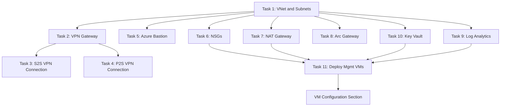

# Manual Deployment Procedures

> **DOCUMENT CATEGORY**: Runbook   
> **SCOPE**: Manual infrastructure deployment procedures   
> **PURPOSE**: Step-by-step deployment of individual components   
> **MASTER REFERENCE**: [Microsoft Learn - Azure Networking](https://learn.microsoft.com/en-us/azure/networking/)

**Status**: Active

## Overview

This section provides **manual deployment procedures** for each Azure management infrastructure component. These procedures are intended for troubleshooting, learning, or deploying individual components when the CI/CD pipeline is unavailable.

:::info Automated Deployment Recommended
For production deployments, use the **[CI/CD Pipeline Deployment](../01-cicd-pipeline-deployment/)** for consistent, repeatable results.

**Repository:** `github.com/AzureLocal/azurelocal-toolkit`
:::

:::tip When to Use Manual Procedures
Use these manual procedures when:
- The CI/CD pipeline is unavailable or experiencing issues
- You need to troubleshoot or customize individual components
- You are learning or validating the deployment process
- You need to deploy a single component without running the full pipeline
:::

## Landing Zone Considerations

Each task in this section includes a **Landing Zone Placement** table showing where resources are deployed under different models. Your deployment model affects which subscription and resource group each resource targets.

| Model | Description | When Used |
|-------|-------------|-----------|
| **Single Subscription** | All resources in one subscription under `rg-azrlmgmt-\{env\}-\{region\}-01` | Small deployments, PoC, single-customer environments |
| **CAF/WAF Landing Zone** | Resources split across Connectivity, Management, and Identity subscriptions per Cloud Adoption Framework | Enterprise deployments, multi-customer, governance-first environments |

:::warning Know Your Landing Zone Model
Before starting, confirm with your project lead which landing zone model applies. This determines the **subscription** and **resource group** for every resource deployed in this section.
:::

## Component Summary

This stage deploys all Azure-side infrastructure needed for Azure Local management. Tasks 01-10 create Azure resources; Task 11 deploys all management VMs.

:::tip VM Configuration
After completing Task 11, proceed to the **[VM Configuration](../03-vm-configuration/)** section to configure individual VM workloads (AD DS, Utility Server, NDM, Lighthouse, WAC). VM Configuration applies regardless of whether you used CI/CD or manual deployment.
:::

### Networking and Platform Resources (Tasks 01-10)

| Task | Component | Classification | Purpose |
|------|-----------|----------------|---------|
| 1 | [Virtual Network and Subnets](./task-01-virtual-network) | **Required** | Azure Local management network |
| 2 | [VPN Gateway](./task-02-vpn-gateway) | **Required** | Site-to-site connectivity to on-prem |
| 3 | [S2S VPN Connection](./task-03-s2s-vpn-connection) | **Required** | Establish tunnel to on-prem site |
| 4 | [P2S VPN Connection](./task-04-p2s-vpn-connection) | **Optional** | Engineer remote access via Azure VPN Client (Entra ID auth) |
| 5 | [Azure Bastion](./task-05-azure-bastion) | **Recommended** | Secure RDP/SSH access to VMs |
| 6 | [Network Security Groups](./task-06-network-security-groups) | **Required** | Subnet-level security rules |
| 7 | [NAT Gateway](./task-07-nat-gateway) | **Required** | Outbound internet for management VMs |
| 8 | [Arc Gateway](./task-08-arc-gateway) | **Optional** | Azure Arc hybrid connectivity |
| 9 | [Log Analytics Workspace](./task-09-log-analytics) | **Recommended** | Monitoring and HCI Insights |
| 10 | [Key Vault](./task-10-key-vault) | **Required** | Secrets management (passwords, keys) |

### Virtual Machine Deployment (Task 11)

| Task | Component | Classification | Purpose |
|------|-----------|----------------|---------|
| 11 | [Deploy Management VMs](./task-11-deploy-management-vms) | **Required** | Create all management VM resources in Azure |

### Cluster Mode (Once per Cluster)

Cluster-specific resources are deployed separately for each Azure Local cluster:

- **VPN Connection** (Local Network Gateway + Connection): Deploy per-site using [Task 3: S2S VPN Connection](./task-03-s2s-vpn-connection)
- **Cluster Key Vault**: See cluster deployment stages
- **Cluster Log Analytics Workspace**: See cluster deployment stages

## Network Architecture

The management VNet uses the following default subnet layout:

| Subnet | Purpose | Default CIDR | Notes |
|--------|---------|--------------|-------|
| `GatewaySubnet` | VPN Gateway | `10.100.1.0/27` | Required name, no NSG |
| `snet-azrl-*` | Management VMs | `10.100.1.32/27` | DCs, Utility, NDM servers |
| `AzureBastionSubnet` | Azure Bastion | `10.100.1.64/26` | Required name, /26 minimum |
| `snet-endpoints-*` | Private Endpoints | `10.100.1.128/27` | Key Vault, Storage endpoints |

## Prerequisites

Before starting this stage, ensure:

- [ ] [Phase 01: Landing Zones](../../phase-01-landing-zones/) completed - Subscription and resource groups exist
- [ ] [Phase 02: Resource Providers](../../phase-02-resource-providers/) completed - Required providers registered
- [ ] [Phase 03: RBAC Permissions](../../phase-03-rbac-permissions/) completed - Deployment identity has required roles
- [ ] Landing zone model confirmed (Single Subscription or CAF/WAF)
- [ ] Network IP address ranges documented (avoid conflicts with on-prem)
- [ ] VPN configuration details from on-prem team (ASN, BGP peer IP, public IP)

## Deployment Order

Components should be deployed in the order listed (Tasks 1-16). Some resources have dependencies:

## Estimated Deployment Time

| Component | Deployment Time |
|-----------|-----------------|
| Virtual Network and Subnets | ~2 minutes |
| VPN Gateway | **30-45 minutes** |
| S2S VPN Connection (per-site) | ~5 minutes |
| P2S VPN Connection (optional) | ~10 minutes |
| Azure Bastion | ~10 minutes |
| NSGs | ~2 minutes |
| NAT Gateway | ~5 minutes |
| Arc Gateway (optional) | ~5 minutes |
| Log Analytics Workspace | ~2 minutes |
| Key Vault | ~3 minutes |
| Deploy Management VMs (all) | ~20 minutes |
| **Total (Infrastructure)** | **~2 hours** |

:::info
VM configuration time (~1.5 hours) is tracked in the **[VM Configuration](../03-vm-configuration/)** section.
:::

:::warning VPN Gateway Deployment
The VPN Gateway takes 30-45 minutes to deploy. Plan accordingly and do not interrupt the deployment.
:::

## Outcome

Upon completion of this stage:

- Management VNet deployed with all required subnets
- Site-to-site VPN connectivity to on-premises established
- Point-to-site VPN available for engineer remote access (if deployed)
- Azure Bastion available for secure VM access
- Network security rules applied
- NAT Gateway providing outbound connectivity
- Arc Gateway ready for hybrid connectivity (if deployed)
- Log Analytics Workspace ready for HCI Insights
- Key Vault provisioned with deployment secrets
- All management VMs deployed and ready for configuration

:::tip Next
Proceed to **[VM Configuration](../03-vm-configuration/)** to configure AD DS, utility server, NDM, Lighthouse, and WAC.
:::

## Next Steps

After completing this stage:

1. **Verify VPN connectivity** with on-premises network team
2. **Configure AD sites and services** on Domain Controllers
3. **Store credentials** in Key Vault (admin passwords, service accounts)
4. Proceed to [Phase 05: Identity and Security](../../phase-05-identity-security/)

---

## Navigation

| Previous | Up | Next |
|----------|-----|------|
| [CI/CD Pipeline Deployment](../01-cicd-pipeline-deployment/) | [Phase 04: Management Infrastructure](../index.mdx) | [Task 01: Virtual Network](./task-01-virtual-network) |

---

## End of Document

---

**Version Control**

- Created: 2025-09-15 by Hybrid Cloud Solutions
- Last Updated: 2026-03-20 by Hybrid Cloud Solutions
- Version: 3.0.0
- Tags: azure-local, manual-deployment, management-infrastructure, networking, vpn, key-vault, landing-zone
- Keywords: manual deployment, virtual network, VPN gateway, bastion, NSG, NAT gateway, key vault, domain controller, landing zone
- Author: Hybrid Cloud Solutions
