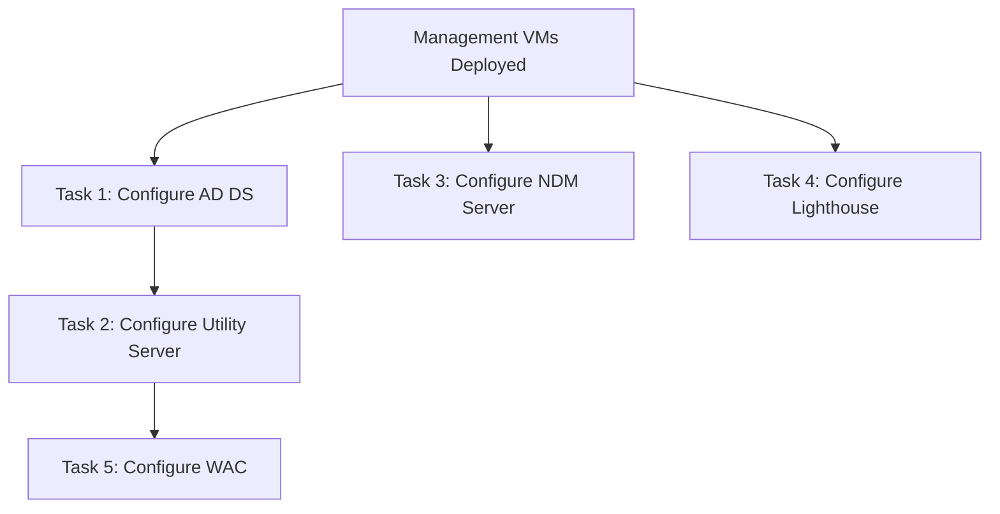

# VM Configuration

> **DOCUMENT CATEGORY**: Runbook
> **SCOPE**: Post-deployment VM configuration
> **PURPOSE**: Configure OS-level services on management VMs
> **MASTER REFERENCE**: [Microsoft Learn - Azure Local](https://learn.microsoft.com/en-us/azure/azure-local/)

**Status**: Active

---

## Overview

After management VMs are provisioned — whether via [CI/CD Pipeline](../01-cicd-pipeline-deployment/) or [Manual Deployment](../02-manual-deployment/) — each VM requires OS-level configuration. These tasks are the same regardless of how the VM was deployed.

:::info Applies to Both Deployment Methods
These tasks apply after **either** deployment method:
- **CI/CD Pipeline** → VMs created by Terraform, then configure here
- **Manual Deployment** → VMs created in Task 11, then configure here
:::

:::warning Hybrid Connectivity Required
These VMs run in Azure. To manage on-premises Azure Local clusters, network devices, and infrastructure from these VMs, you need **site-to-site VPN** or **Azure ExpressRoute** connectivity between your Azure VNet and on-premises network. Ensure hybrid connectivity is established before proceeding.
:::

## Configuration Tasks

| Task | Component | Classification | Purpose |
|------|-----------|----------------|---------|
| 1 | [Configure AD DS](./task-01-configure-adds) | **Required** | Promote DCs, create forest, configure DNS |
| 2 | [Configure Utility Server](./task-02-configure-utility-server) | **Recommended** | Domain join, install admin tools (jump box) |
| 3 | [Configure NDM Server](./task-03-configure-ndm-server) | **Recommended** | SYSLOG/SNMP collection for Azure Monitor |
| 4 | [Configure Lighthouse Server](./task-04-configure-lighthouse) | **Optional** | OpenGear out-of-band console management |
| 5 | [Configure Windows Admin Center](./task-05-configure-wac) | **Optional** | Web-based Azure Local cluster management |

## Dependencies

- **Task 1 (AD DS)** must complete first — it creates the domain that Tasks 2 and 5 join
- **Tasks 3 and 4** are independent — they can run in parallel with Task 2
- **Task 5 (WAC)** requires Task 2 — WAC installs on the utility server

## VM Summary

| VM | OS | Role | Required |
|----|----|------|----------|
| dc01 / dc02 | Windows Server 2025 | Domain Controllers | Yes |
| utility | Windows Server 2025 | Jump box + admin tools | Recommended |
| ndm | Ubuntu 24.04 LTS | SYSLOG/SNMP → Azure Monitor | Recommended |
| lighthouse | OpenGear Lighthouse | OOB console management | Optional |

## Prerequisites

- [ ] Management VMs deployed (via [CI/CD Pipeline](../01-cicd-pipeline-deployment/) or [Manual Deployment Task 11](../02-manual-deployment/task-11-deploy-management-vms))
- [ ] Azure Bastion or VPN connectivity for VM access
- [ ] VM admin credentials available (stored in Key Vault)
- [ ] Hybrid connectivity (S2S VPN or ExpressRoute) established

## Estimated Time

| Task | Duration |
|------|----------|
| Configure AD DS | ~30 minutes (includes reboot) |
| Configure Utility Server | ~15 minutes |
| Configure NDM Server | ~15 minutes |
| Configure Lighthouse | ~20 minutes |
| Configure WAC | ~15 minutes |
| **Total** | **~1.5 hours** |

## Next Steps

After completing VM configuration:

1. **Verify S2S VPN** connectivity with on-premises network team
2. **Configure AD sites and services** for on-premises replication
3. **Store service account credentials** in Key Vault
4. Proceed to [Phase 05: Identity & Access Management](../../phase-05-identity-security/)

---

## Navigation

| Previous | Up | Next |
|----------|-----|------|
| [Manual Deployment](../02-manual-deployment/) | [Phase 04: Management Infrastructure](../index.mdx) | [Phase 05: Identity & Access Management](../../phase-05-identity-security/) |

---

## End of Document

---

**Version Control**

- Created: 2025-09-15 by Hybrid Cloud Solutions
- Last Updated: 2026-03-20 by Hybrid Cloud Solutions
- Version: 3.0.0
