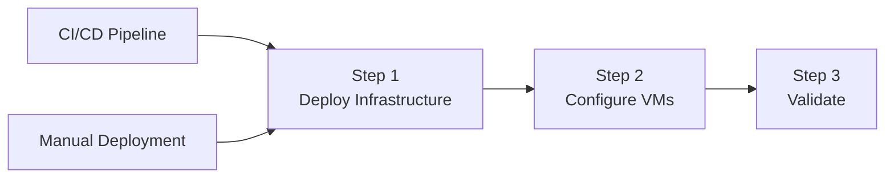

import Tabs from '@theme/Tabs';
import TabItem from '@theme/TabItem';

# Phase 04: Azure Management Infrastructure

> **DOCUMENT CATEGORY**: Runbook 
> **SCOPE**: Azure management resources deployment 
> **PURPOSE**: Deploy networking, VMs, and monitoring resources 
> **MASTER REFERENCE**: [Microsoft Learn - Azure Networking](https://learn.microsoft.com/en-us/azure/networking/)

**Status**: Active

---

## Overview

This phase deploys all Azure-side infrastructure needed for Azure Local management and operations. The deployment is organized into three steps:

1. **Deploy Infrastructure** — Provision Azure networking, security, and VM resources (choose CI/CD or manual)
2. **Configure VMs** — Configure management VM workloads (AD DS, utility server, NDM, Lighthouse, WAC)
3. **Validate** — Verify connectivity and service health

:::warning Hybrid Connectivity Required
This phase deploys resources in Azure. **Site-to-Site VPN or ExpressRoute** connectivity between Azure and your on-premises environment is required for management VMs to communicate with Azure Local clusters. Ensure hybrid connectivity is planned before proceeding.
:::

---

## Step 1: Deploy Infrastructure

Provision Azure networking, platform resources, and management VMs. Choose the deployment method that best suits your needs:

<Tabs groupId="deployment-method">
<TabItem value="pcs-cicd" label="CI/CD Pipeline (Recommended)" default>

**✅ Recommended for production deployments**

Deploy the complete Azure management infrastructure using the automated CI/CD Pipeline with the `azurelocal-toolkit` Terraform modules.

**Benefits:**
- ✅ Consistent, repeatable deployments
- ✅ Infrastructure as Code (IaC) with version control
- ✅ Automated testing and validation
- ✅ Proper state management via CI/CD pipeline
- ✅ Faster deployment with parallel resource creation

**Repository:** `github.com/AzureLocal/azurelocal-toolkit`

:::info CI/CD Module Scope
The CI/CD module deploys core infrastructure but has the following limitations:

**Not Included in CI/CD Module:**
- ❌ **OpenGear Lighthouse Server** — Must be deployed via [Manual Task 11](./02-manual-deployment/task-11-deploy-management-vms)
- ❌ **Windows Admin Center (WAC) Server** — Must be deployed via [Manual Task 11](./02-manual-deployment/task-11-deploy-management-vms)

**Fixed Configuration:**
- 📌 **Landing Zone**: Uses [single subscription model](../phase-01-landing-zones/)
- 📌 **Resource Groups**: Predefined naming and structure

For deployments requiring these components or custom landing zones, supplement with [Manual Deployment](./02-manual-deployment/) steps.
:::

**👉 [Go to CI/CD Pipeline Deployment](./01-cicd-pipeline-deployment/)**

</TabItem>
<TabItem value="manual" label="Manual Deployment">

**When to use:**
- The CI/CD pipeline is unavailable or experiencing issues
- You need to troubleshoot or customize individual components
- You're learning or validating the deployment process
- You need to deploy a single component without running the full pipeline

**👉 [Go to Manual Deployment Procedures](./02-manual-deployment/)**

</TabItem>
</Tabs>

---

## Step 2: Configure VMs

After infrastructure is deployed (regardless of deployment method), configure the management VM workloads:

**👉 [Go to VM Configuration](./03-vm-configuration/)**

| Task | Component | Classification | Purpose |
|------|-----------|----------------|----------|
| 1 | [Configure AD DS](./03-vm-configuration/task-01-configure-adds) | **Required** | Promote DCs, create forest, configure DNS |
| 2 | [Configure Utility Server](./03-vm-configuration/task-02-configure-utility-server) | **Recommended** | Domain join, install admin tools (jump box) |
| 3 | [Configure NDM Server](./03-vm-configuration/task-03-configure-ndm-server) | **Recommended** | rsyslog, SNMP trap receiver for Azure Monitor |
| 4 | [Configure Lighthouse Server](./03-vm-configuration/task-04-configure-lighthouse) | **Recommended** | Docker, OpenGear Lighthouse container |
| 5 | [Configure WAC](./03-vm-configuration/task-05-configure-wac) | **Recommended** | Windows Admin Center gateway |

:::info
VM Configuration tasks apply to all deployment methods. Whether you used CI/CD or manual deployment for infrastructure, these steps are always required.
:::

---

## Step 3: Validate

After completing VM configuration, verify:

- [ ] VPN connectivity between Azure and on-premises is operational
- [ ] Domain Controllers are reachable and DNS resolves correctly
- [ ] Utility server can RDP to Azure Local cluster nodes
- [ ] NDM server is receiving syslog/SNMP data from network devices
- [ ] WAC can connect to Azure Local cluster
- [ ] Log Analytics Workspace is collecting data

---

## Component Summary

All components deployed across Steps 1 and 2:

### Management Mode (Once per Environment)

#### Infrastructure Resources (Step 1)

| Component | Classification | CI/CD Module | Manual | Purpose |
|-----------|----------------|------------|--------|----------|
| Virtual Network & Subnets | **Required** | ✅ | ✅ | Azure Local management network |
| VPN Gateway | **Required** | ✅ | ✅ | Site-to-site connectivity to on-prem |
| VPN Connection | **Required** | ✅ | ✅ | Establish tunnel to on-prem site |
| Azure Bastion | **Recommended** | ✅ | ✅ | Secure RDP/SSH access to VMs |
| Network Security Groups | **Required** | ✅ | ✅ | Subnet-level security rules |
| NAT Gateway | **Required** | ✅ | ✅ | Outbound internet for management VMs |
| Arc Gateway | **Optional** | ✅ | ✅ | Azure Arc hybrid connectivity |
| Log Analytics Workspace | **Recommended** | ✅ | ✅ | Monitoring and HCI Insights |
| Key Vault | **Required** | ✅ | ✅ | Secrets management (passwords, keys) |
| Management VMs | **Required** | ⚠️ Optional | ✅ | DC, Utility, NDM, Lighthouse, WAC VMs |

#### VM Configuration (Step 2)

| Component | Classification | Purpose |
|-----------|----------------|----------|
| Active Directory Domain Services | **Required** | Promote DCs, create forest, configure DNS |
| Utility Server (Jump Box) | **Recommended** | Domain join, admin tools, RDP gateway |
| NDM Server | **Recommended** | rsyslog + SNMP collection → Azure Monitor |
| Lighthouse Server | **Recommended** | OpenGear console server management |
| Windows Admin Center | **Recommended** | Web-based cluster management portal |

### Cluster Mode (Once per Cluster)

Cluster-specific resources are deployed separately for each Azure Local cluster:

- **VPN Connection** (Local Network Gateway + Connection): Deploy per-site
- **Cluster Key Vault**: See cluster deployment stages
- **Cluster Log Analytics Workspace**: See cluster deployment stages

## Prerequisites

Before starting this phase, ensure:

- [ ] [Phase 01: Landing Zones](../phase-01-landing-zones/) completed - Subscription and resource groups exist
- [ ] [Phase 02: Resource Providers](../phase-02-resource-providers/) completed - Required providers registered
- [ ] [Phase 03: RBAC Permissions](../phase-03-rbac-permissions/) completed - Deployment identity has required roles
- [ ] Network IP address ranges documented (avoid conflicts with on-prem)
- [ ] VPN configuration details from on-prem team (ASN, BGP peer IP, public IP)

## Next Steps

After completing this phase:

1. **Verify VPN connectivity** with on-premises network team
2. **Configure AD sites and services** on Domain Controllers
3. **Store credentials** in Key Vault (admin passwords, service accounts)
4. Proceed to [Phase 05: Identity & Access Management](../phase-05-identity-security/)

---

## Navigation

| Previous | Up | Next |
|----------|-----|------|
| [Phase 03: RBAC Permissions](../phase-03-rbac-permissions/) | [Azure Foundation](../index.mdx) | [Phase 05: Identity & Access Management](../phase-05-identity-security/) |

---

## End of Document

---

**Version Control**

- Created: 2025-09-15 by Hybrid Cloud Solutions
- Last Updated: 2026-03-20 by Hybrid Cloud Solutions
- Version: 2.0.0
- Tags: azure-local, management-infrastructure, networking, vpn, key-vault, domain-controllers, bastion
- Keywords: management infrastructure, virtual network, VPN gateway, bastion, NSG, NAT gateway, key vault, domain controller, log analytics
- Author: Hybrid Cloud Solutions
