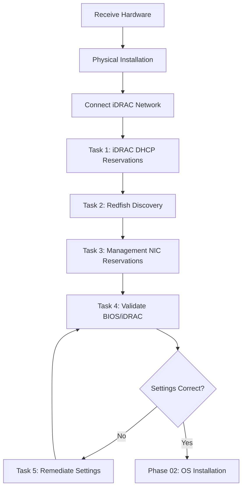

# Phase 01: Hardware Provisioning and BIOS/iDRAC Configuration

[](./index.mdx)
[](https://learn.microsoft.com/en-us/azure/azure-local/)
[](https://www.dell.com/)

> **DOCUMENT CATEGORY**: Runbook   
> **SCOPE**: Azure Local cluster hardware provisioning   
> **PURPOSE**: Discover all cluster node hardware, configure DHCP reservations, validate BIOS/iDRAC settings against Dell Azure Local validated baselines, and remediate any configuration gaps before OS installation   
> **MASTER REFERENCE**: [Microsoft Learn - Azure Local Hardware Requirements](https://learn.microsoft.com/en-us/azure/azure-local/concepts/system-requirements)

**Status**: Active

## Phase 01 — Table of Contents

| Task | Description | Duration | Link |
|------|-------------|----------|------|
| 1 | Create DHCP Reservations for iDRAC Interfaces | 15 min | [Task 1](./task-01-create-dhcp-reservations-for-idrac-interfaces.mdx) |
| 2 | Hardware Discovery via Dell Redfish API | 30 min | [Task 2](./task-02-hardware-discovery-via-dell-redfish-api.mdx) |
| 3 | Create DHCP Reservations for Management NICs (Optional) | 15 min | [Task 3](./task-03-create-dhcp-reservations-for-management-nics.mdx) |
| 4 | BIOS and iDRAC Settings Validation | 30 min | [Task 4](./task-04-bios-and-idrac-settings-validation.mdx) |
| 5 | BIOS and iDRAC Settings Remediation | 30 min | [Task 5](./task-05-bios-and-idrac-settings-remediation.mdx) |

---

## Prerequisites

- Phase 03 Network Infrastructure complete (iDRAC network operational, iDRAC IPs accessible)
- iDRAC accessible via OpenGear console server or direct network access
- iDRAC credentials available (default: `root` / configured password)
- PowerShell 7+ with `Invoke-RestMethod` cmdlet
- DHCP server access for creating reservations
- Dell Azure Local Validated Node Configuration Guide available

:::warning Important Notes
- **Firmware updates are NOT performed in this phase** — Firmware management is handled automatically by the Azure Local Solution Builder Extension (SBE) during cluster deployment in Phase 05
- This phase focuses on hardware discovery, DHCP configuration, and BIOS/iDRAC settings validation/remediation only
:::

---

---

## Validation Checklist

- [ ] Hardware inventory JSON files created for all nodes
- [ ] Service tags collected for all nodes
- [ ] iDRAC MAC addresses collected for all nodes
- [ ] System NIC MAC addresses collected (management interfaces)
- [ ] DHCP reservations created for all iDRAC interfaces
- [ ] (Optional) DHCP reservations created for all management NICs
- [ ] BIOS settings validated against Dell Azure Local baseline (100% compliance)
- [ ] iDRAC settings validated against enterprise operational standards (100% compliance)
- [ ] All non-compliant settings remediated and re-validated
- [ ] Hardware inventory documented and stored in site configuration folder

---

## Outcome

Complete hardware inventory documented, DHCP reservations configured, BIOS and iDRAC settings validated and compliant with Dell Azure Local baselines, ready for Phase 02 (OS Installation).

---

## Hardware Requirements

### Supported Dell Platforms

All Dell AX nodes for Azure Local are **Premier Solutions** — validated through deep collaboration between Dell Technologies and Microsoft.

| Model | Chassis | CPU | Nodes | Tier |
|-------|---------|-----|-------|------|
| AX-760 | 2U rack | Intel 5th Gen Xeon Scalable | 1–16 | Premier Solution |
| AX-660 | 1U rack | Intel 5th Gen Xeon Scalable | 1–16 | Premier Solution |
| AX-4510c / AX-4520c | AX-4000r/z (4U) | Intel Xeon D 27xx | 1–16 | Premier Solution |


---

---

## Network Infrastructure

### Required VLANs

:::info Network VLAN Configuration
Network VLAN assignments are site-specific and defined in `variables.yml`.
:::

| Network | Variable Path | Purpose |
|---------|---------------|---------|
| iDRAC/BMC | `vlans.oob.vlan_id` | Out-of-band management |
| Management | `vlans.management.vlan_id` | Cluster management |
| Storage | `vlans.storage.vlan_id` | Storage Spaces Direct |
| Compute | `vlans.compute.vlan_id` | VM traffic |

---

## Workflow Diagram



---

## Quick Start

Test iDRAC connectivity for all nodes before starting. iDRAC IPs are defined in `variables.yml` under `nodes.<name>.idrac_ip`.

```powershell
# Load iDRAC IPs from variables.yml
Import-Module powershell-yaml
$config = Get-Content ".\config\variables.yml" -Raw | ConvertFrom-Yaml
$iDRACIPs = $config.nodes.Values | ForEach-Object { $_.idrac_ip }

foreach ($ip in $iDRACIPs) {
 $result = Test-NetConnection -ComputerName $ip -Port 443 -WarningAction SilentlyContinue
 $status = if ($result.TcpTestSucceeded) { "Reachable" } else { "Not Reachable" }
 Write-Host "iDRAC $ip : $status"
}
```

---

## Next Steps

After completing hardware provisioning, proceed to [Phase 02: OS Installation](../phase-02-os-installation/index.mdx).

---

**References**:
- [Dell Redfish API Guide](https://www.dell.com/support/kbdoc/en-us/000177920/dell-poweredge-redfish-api-user-s-guide)
- [Dell iDRAC Documentation](https://www.dell.com/support/home/en-us/product-support/product/idrac9-datacenter)
- [Microsoft Learn - Azure Local Hardware](https://learn.microsoft.com/en-us/azure/azure-local/concepts/system-requirements)

---

| Version | Date | Author | Notes |
|---------|------|--------|-------|
| 1.0 | 2026-01-01 | Azure Local Cloud Azure Local Cloudnology | Initial release |
| 1.1 | 2026-03-03 | Azure Local Cloud Azure Local Cloudnology | Fix task ordering, stage references, standards alignment |
