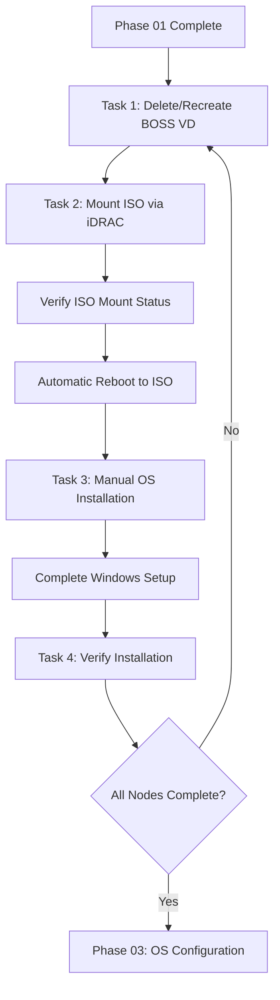

import Tabs from '@theme/Tabs';
import TabItem from '@theme/TabItem';

# Phase 02: OS Installation

[](./index.mdx)
[](https://learn.microsoft.com/en-us/azure/azure-local/)
[](https://www.dell.com/)

> **DOCUMENT CATEGORY**: Runbook 
> **SCOPE**: Azure Local cluster OS installation 
> **PURPOSE**: Install Azure Stack HCI OS on all cluster nodes using the Dell Gold Image ISO via iDRAC virtual media and BOSS card preparation 
> **MASTER REFERENCE**: [Microsoft Learn - Deploy Azure Local](https://learn.microsoft.com/en-us/azure/azure-local/deploy/deployment-introduction)

**Status**: Active

---

## Overview

Install Azure Stack HCI OS on all cluster nodes. This phase covers ISO mounting via iDRAC virtual media, BOSS card virtual disk preparation, manual OS installation through iDRAC Virtual Console, and post-install verification.

:::warning Important Notes
- **BOSS deletion triggers reboot** — Deleting and recreating BOSS virtual disks creates a configuration job that requires a reboot to apply
- **Automatic boot to ISO** — After the BOSS recreation reboot, the server boots from the ISO automatically (BOSS has no OS yet)
- **No automated OS deployment** — Installation is performed manually through iDRAC Virtual Console
- **Do NOT domain join nodes** — Nodes must remain in workgroup until after Azure Local cluster deployment
:::

---

## Phase 02 — Table of Contents

| Task | Description | Duration | Link |
|------|-------------|----------|------|
| 1 | Delete and Recreate Virtual Disk on Dell BOSS Card | 15 min | [Task 1](./task-01-delete-and-recreate-virtual-disk-on-dell-boss-card.mdx) |
| 2 | Mount and Verify Dell Gold Image ISO | 15 min | [Task 2](./task-02-mount-and-verify-dell-gold-image-iso.mdx) |
| 3 | Manual OS Installation | 30–45 min | [Task 3](./task-03-manual-os-installation.mdx) |
| 4 | Verify OS Deployment | 15 min | [Task 4](./task-04-verify-os-deployment.mdx) |

---

## Prerequisites

| Requirement | Description | Source |
|-------------|-------------|--------|
| Phase 01 Complete | BIOS and iDRAC settings validated and compliant (Tasks 04/05) | [Phase 01](../phase-01-hardware-provisioning/index.mdx) |
| Dell BOSS Cards | Boot Optimized Storage Solution cards installed in all nodes | Hardware |
| iDRAC Access | Virtual Console and Virtual Media control available | `variables.yml: nodes.<name>.idrac_ip` |
| Gold Image ISO | Dell Azure Local Gold Image ISO available on network share or USB | Azure Local Cloud build team |

---

## Dell BOSS Card Overview

The Dell Boot Optimized Storage Solution (BOSS) card provides dedicated boot storage for Azure Local nodes:

| Feature | Description |
|---------|-------------|
| Configuration | Two M.2 SATA SSDs configured as RAID-1 mirror |
| Purpose | OS boot resilience — OS failure does not affect data drives |
| Controller | Dell BOSS controller (separate from the storage RAID controller) |
| Presentation | Appears as a single virtual disk to the OS |
| Requirement | Requires a full delete → create → initialize cycle before a fresh OS install |

:::info Azure Local Cloud Dell Gold Image
Azure Local Cloud maintains a Dell Gold Image with pre-configured drivers optimized for Azure Local deployments. The image includes:
- Pre-installed Dell OpenManage and hardware drivers
- Optimized Windows Server Core settings for Azure Local
:::

---

## Validation Checklist

- [ ] BOSS virtual disks deleted and recreated on all nodes
- [ ] Dell Gold Image ISO mounted and verified on all nodes (`Inserted: true`)
- [ ] Nodes rebooted and booted from ISO after BOSS recreation
- [ ] Azure Stack HCI OS installed successfully on all nodes
- [ ] OS installed to Dell BOSS card M.2 RAID-1 volume
- [ ] Administrator passwords set and stored securely
- [ ] All nodes boot to Server Core command prompt
- [ ] OS verified per Task 4 checklist

---

## Outcome

Upon completion of this phase:

- Dell BOSS virtual disks recreated on all nodes per Dell validated practices
- Azure Stack HCI OS installed on all cluster nodes
- OS installed to Dell BOSS card M.2 RAID-1 volumes
- Administrator passwords documented securely in Azure Key Vault
- All nodes boot to Server Core command prompt
- Nodes ready for Phase 03: OS Configuration

---

## Workflow Diagram



---

## Quick Start

Verify iDRAC Virtual Console and Virtual Media access for all nodes before starting. iDRAC IPs are defined in `variables.yml` under `nodes.<name>.idrac_ip`.

```powershell
# Test iDRAC connectivity for all nodes
Import-Module powershell-yaml
$config = Get-Content ".\config\variables.yml" -Raw | ConvertFrom-Yaml
$config.nodes.Values | ForEach-Object {
 $result = Test-NetConnection -ComputerName $_.idrac_ip -Port 443 -WarningAction SilentlyContinue
 $status = if ($result.TcpTestSucceeded) { "Reachable" } else { "Unreachable" }
 Write-Host "$($_.hostname) iDRAC ($($_.idrac_ip)): $status"
}
```

---

## Navigation

| | | |
|:--|:--:|--:|
| ← [Phase 01: Hardware Provisioning](../phase-01-hardware-provisioning/index.mdx) | [↑ Cluster Deployment](../index.mdx) | [Phase 03: OS Configuration →](../phase-03-os-configuration/index.mdx) |

---

## Version Control

| Version | Date | Author | Changes |
|---------|------|--------|---------|
| 1.0 | 2026-01-31 | Azure Local Cloud Azure Local Cloudnology | Initial document |
| 1.1 | 2026-03-04 | Azure Local Cloud Azure Local Cloudnology | Fix frontmatter, badges, stage references, standards alignment |