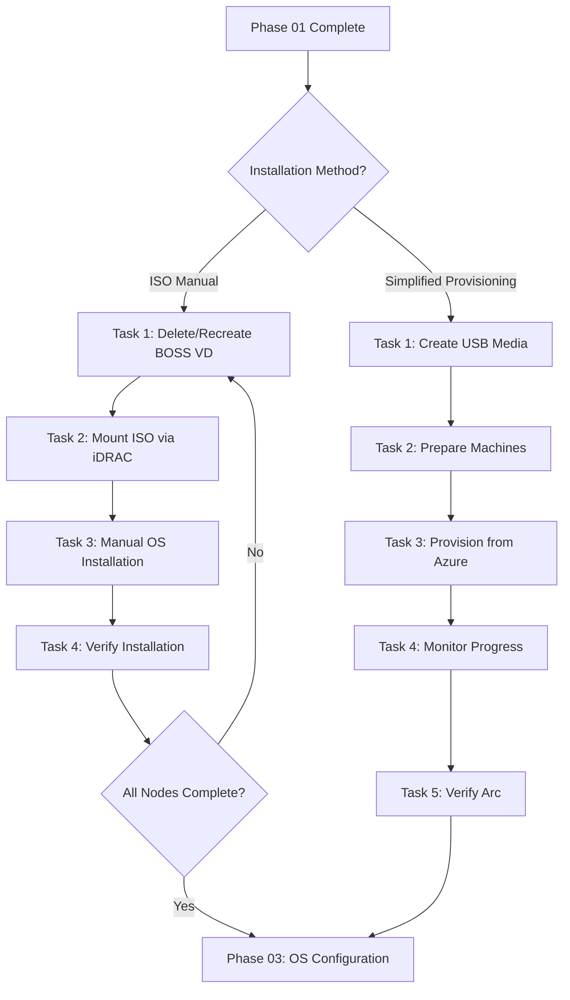

---
title: "Phase 02: OS Installation"
sidebar_label: "Phase 02: OS Installation"
sidebar_position: 2
description: "Install Azure Stack HCI OS on cluster nodes using ISO-based manual installation or Simplified Machine Provisioning (Preview)."
category: Runbook
scope: Azure Local cluster OS installation
purpose: Install Azure Stack HCI OS on all cluster nodes using ISO or Simplified Provisioning
author: Azure Local Cloud
created: 2026-01-31
updated: 2026-05-01
version: 1.2
tags: ["azure-local", "os-installation", "azure-stack-hci", "dell", "boss", "idrac", "simplified-provisioning"]
keywords: ["Azure Stack HCI OS", "OS installation", "Dell BOSS card", "iDRAC virtual media", "gold image ISO", "Server Core", "simplified provisioning", "FDO", "zero touch"]
status: Active
---

import Tabs from '@theme/Tabs';
import TabItem from '@theme/TabItem';

# Phase 02: OS Installation

[](./index.mdx)
[](https://learn.microsoft.com/en-us/azure/azure-local/)
[](https://www.dell.com/)

> **DOCUMENT CATEGORY**: Runbook   
> **SCOPE**: Azure Local cluster OS installation   
> **PURPOSE**: Install Azure Stack HCI OS on all cluster nodes   
> **MASTER REFERENCE**: [Microsoft Learn - Deploy Azure Local](https://learn.microsoft.com/en-us/azure/azure-local/deploy/deployment-introduction?view=azloc-2604)

**Status**: Active

## Overview

Azure Local supports two methods for installing the Azure Stack HCI OS on cluster nodes:

1. **ISO-Based Manual Installation** (GA) — Download the ISO, mount via iDRAC/BMC virtual media, and manually run Windows Setup on each node
2. **Simplified Machine Provisioning** (Preview) — Use a USB-based maintenance environment with FIDO Device Onboarding (FDO) to provision machines from Azure automatically

Choose the method that best fits your environment using the comparison below.

---

## Installation Method Comparison

| Aspect | ISO (Manual) | Simplified Provisioning (Preview) |
|--------|-------------|-----------------------------------|
| **Status** | ✅ GA — production supported | ⚠️ Preview — East US only |
| **OS Installation** | Manual via iDRAC/BMC console | Automated from Azure |
| **Physical Access** | Required for iDRAC virtual media | Required for initial USB boot |
| **Network Configuration** | Manual (SConfig or PowerShell) | Automated from Azure portal |
| **Azure Arc Registration** | Separate step ([Phase 04](../phase-04-arc-registration/index.mdx)) | Included in provisioning flow |
| **Arc Gateway Support** | ✅ Supported | ❌ Not supported (preview) |
| **Supported Hardware** | All [Azure Local Catalog](https://aka.ms/AzureStackHCICatalog) hardware | Dell AX-650/750, Lenovo MX650 V3/V4, HPE DL360 Gen11 |
| **Best For** | Production deployments, all hardware | Automated provisioning of supported SKUs |

:::tip Recommendation
Use **ISO-based installation** for production deployments until Simplified Provisioning reaches GA. Use Simplified Provisioning for evaluation and supported hardware in East US.
:::

---

## Method 1: ISO-Based Manual Installation

The traditional approach: prepare Dell BOSS cards, mount the ISO via iDRAC virtual media, and manually install the OS on each node.

:::warning Important Notes
- **BOSS deletion triggers reboot** — Deleting and recreating BOSS virtual disks creates a configuration job that requires a reboot to apply
- **Automatic boot to ISO** — After the BOSS recreation reboot, the server boots from the ISO automatically (BOSS has no OS yet)
- **No automated OS deployment** — Installation is performed manually through iDRAC Virtual Console
- **Do NOT domain join nodes** — Nodes must remain in workgroup until after Azure Local cluster deployment
:::

### ISO Tasks

| Task | Description | Duration | Link |
|------|-------------|----------|------|
| 1 | Delete and Recreate Virtual Disk on Dell BOSS Card | 15 min | [Task 1](./task-01-delete-and-recreate-virtual-disk-on-dell-boss-card.mdx) |
| 2 | Mount and Verify Dell Gold Image ISO | 15 min | [Task 2](./task-02-mount-and-verify-dell-gold-image-iso.mdx) |
| 3 | Manual OS Installation | 30–45 min | [Task 3](./task-03-manual-os-installation.mdx) |
| 4 | Verify OS Deployment | 15 min | [Task 4](./task-04-verify-os-deployment.mdx) |

---

## Method 2: Simplified Machine Provisioning (Preview)

An automated approach that uses a USB-based maintenance environment with FIDO Device Onboarding to provision machines directly from Azure.

:::warning Preview Feature
Simplified machine provisioning is **in preview**. Only East US region is supported. Arc Gateway is not supported. Review the [Microsoft preview terms](https://azure.microsoft.com/support/legal/preview-supplemental-terms/) before use.
:::

### Simplified Provisioning Tasks

| Task | Description | Duration | Link |
|------|-------------|----------|------|
| 1 | Create USB Installation Media | 15 min | [Task 1](./simplified-provisioning/task-01-create-usb-media.mdx) |
| 2 | Prepare Machines | 30 min/machine | [Task 2](./simplified-provisioning/task-02-prepare-machines.mdx) |
| 3 | Provision Machines from Azure | 15 min + wait | [Task 3](./simplified-provisioning/task-03-provision-from-azure.mdx) |
| 4 | Monitor Machine Setup | 30–60 min | [Task 4](./simplified-provisioning/task-04-monitor-progress.mdx) |
| 5 | Verify Azure Arc Connectivity | 10 min | [Task 5](./simplified-provisioning/task-05-verify-arc.mdx) |

For full details, see the [Simplified Provisioning Guide](./simplified-provisioning/index.mdx).

---

## Prerequisites

| Requirement | Description | Source |
|-------------|-------------|--------|
| Phase 01 Complete | BIOS and iDRAC settings validated and compliant (Tasks 04/05) | [Phase 01](../phase-01-hardware-provisioning/index.mdx) |
| Dell BOSS Cards | Boot Optimized Storage Solution cards installed in all nodes (ISO method) | Hardware |
| iDRAC Access | Virtual Console and Virtual Media control available (ISO method) | `variables.yml: nodes.<name>.idrac_ip` |
| Gold Image ISO | Dell Azure Local Gold Image ISO available (ISO method) | Build team |
| USB Flash Drive | At least 8 GB (Simplified Provisioning method) | Operator |
| Windows 11 PC | For USB prep tool and Configurator app (Simplified Provisioning method) | Operator |

---

## Dell BOSS Card Overview

The Dell Boot Optimized Storage Solution (BOSS) card provides dedicated boot storage for Azure Local nodes:

| Feature | Description |
|---------|-------------|
| Configuration | Two M.2 SATA SSDs configured as RAID-1 mirror |
| Purpose | OS boot resilience — OS failure does not affect data drives |
| Controller | Dell BOSS controller (separate from the storage RAID controller) |
| Presentation | Appears as a single virtual disk to the OS |
| Requirement | Requires a full delete → create → initialize cycle before a fresh OS install |

:::info Azure Local Cloud Dell Gold Image
Azure Local Cloud maintains a Dell Gold Image with pre-configured drivers optimized for Azure Local deployments. The image includes:
- Pre-installed Dell OpenManage and hardware drivers
- Optimized Windows Server Core settings for Azure Local
:::

---

## Validation Checklist

### ISO Method
- [ ] BOSS virtual disks deleted and recreated on all nodes
- [ ] Dell Gold Image ISO mounted and verified on all nodes (`Inserted: true`)
- [ ] Nodes rebooted and booted from ISO after BOSS recreation
- [ ] Azure Stack HCI OS installed successfully on all nodes
- [ ] OS installed to Dell BOSS card M.2 RAID-1 volume
- [ ] Administrator passwords set and stored securely
- [ ] All nodes boot to Server Core command prompt
- [ ] OS verified per Task 4 checklist

### Simplified Provisioning Method
- [ ] USB installation media created successfully
- [ ] All machines booted from USB and maintenance environment completed
- [ ] Ownership vouchers collected for all machines
- [ ] Machines provisioned from Azure portal
- [ ] All machines show "Ready to cluster" in Azure Arc

---

## Outcome

Upon completion of this phase (either method):

- Azure Stack HCI OS installed on all cluster nodes
- Administrator passwords documented securely in Azure Key Vault
- All nodes boot to Server Core command prompt
- Nodes ready for Phase 03: OS Configuration

---

## Workflow Diagram



---

## Quick Start

Verify iDRAC Virtual Console and Virtual Media access for all nodes before starting. iDRAC IPs are defined in `variables.yml` under `nodes.<name>.idrac_ip`.

```powershell
# Test iDRAC connectivity for all nodes
Import-Module powershell-yaml
$config = Get-Content ".\config\variables.yml" -Raw | ConvertFrom-Yaml
$config.nodes.Values | ForEach-Object {
 $result = Test-NetConnection -ComputerName $_.idrac_ip -Port 443 -WarningAction SilentlyContinue
 $status = if ($result.TcpTestSucceeded) { "Reachable" } else { "Unreachable" }
 Write-Host "$($_.hostname) iDRAC ($($_.idrac_ip)): $status"
}
```

---

## Navigation

| | | |
|:--|:--:|--:|
| ← [Phase 01: Hardware Provisioning](../phase-01-hardware-provisioning/index.mdx) | [↑ Cluster Deployment](../index.mdx) | [Phase 03: OS Configuration →](../phase-03-os-configuration/index.mdx) |

---

## Version Control

| Version | Date | Author | Changes |
|---------|------|--------|---------|
| 1.0 | 2026-01-31 | Azure Local Cloud | Initial document |
| 1.1 | 2026-03-04 | Azure Local Cloud | Fix frontmatter, badges, stage references, standards alignment |
| 1.2 | 2026-05-01 | Azure Local Cloud | Add Simplified Machine Provisioning (Preview) section, update to decision page format |