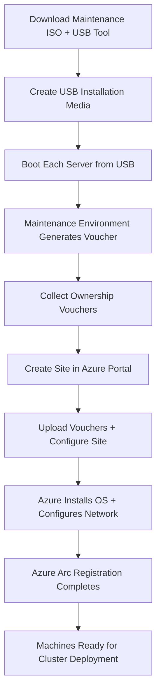

import Tabs from '@theme/Tabs';
import TabItem from '@theme/TabItem';

# Simplified Machine Provisioning (Preview)

> **DOCUMENT CATEGORY**: Runbook
> **SCOPE**: Azure Local OS installation via simplified provisioning
> **PURPOSE**: Install OS and register machines from Azure using FIDO Device Onboarding
> **MASTER REFERENCE**: [Microsoft Learn — Simplified Machine Provisioning](https://learn.microsoft.com/en-us/azure/azure-local/deploy/simplified-machine-provisioning?view=azloc-2604)

**Status**: Active

:::warning Preview Feature
Simplified machine provisioning is currently **in preview**. Review the [Supplemental Terms of Use for Microsoft Azure Previews](https://azure.microsoft.com/support/legal/preview-supplemental-terms/) before using in production.

- **Supported region**: East US only (preview)
- **Arc Gateway**: Not supported in this preview release
- **Production recommendation**: Use [ISO-based installation](../index.mdx) for production deployments until this feature reaches GA
:::

---

## Overview

Simplified machine provisioning offers an alternative to manual ISO installation. Instead of creating boot media, connecting to each server's management interface, and manually running Windows Setup, this workflow:

1. **Prepares machines** with a USB-based maintenance environment that generates [FIDO Device Onboarding (FDO)](https://fidoalliance.org/device-onboarding-overview/) ownership vouchers
2. **Provisions machines from Azure** — the OS is downloaded and installed automatically, with network configuration and Azure Arc registration handled remotely
3. **Deploys the cluster** using the provisioned machines, just as with ISO-based installation

This approach is most valuable when someone other than on-site staff prepares the machines (e.g., a hardware manufacturer or integrator), and on-site staff simply power them on and connect them to the network.

:::tip Community Automation — azurelocal-ztp
For a fully automated approach that **bypasses the manual USB media step entirely**, see the [azurelocal-ztp](https://github.com/AzureLocal/azurelocal-ztp) project. It uses BMC/Redfish (iDRAC, XCC, iLO) to mount the maintenance-environment ISO as virtual media, set the boot source, and reboot — all without anyone in the rack and without physical USB media.

This is especially useful for remote or lights-out deployments where physical access is limited.
:::

---

## ISO vs Simplified Provisioning Comparison

| Aspect | ISO (Manual) | Simplified Provisioning (Preview) |
|--------|-------------|-----------------------------------|
| **Status** | GA — production supported | Preview — East US only |
| **OS Installation** | Manual via iDRAC/BMC virtual console | Automated from Azure |
| **Physical Access** | Required for initial ISO boot | Required for initial USB boot |
| **Network Configuration** | Manual (SConfig or PowerShell) | Automated from Azure portal |
| **Azure Arc Registration** | Separate step (Phase 04) | Included in provisioning flow |
| **Arc Gateway Support** | ✅ Supported | ❌ Not supported (preview) |
| **Supported Hardware** | All Azure Local Catalog hardware | Dell AX-650/750, Lenovo MX650 V3/V4, HPE DL360 Gen11 |
| **Best For** | Production deployments, all hardware | Automated provisioning of supported SKUs |

---

## Supported Hardware SKUs

| Vendor | Model | BMC |
|--------|-------|-----|
| Dell | AX-650, AX-750 | iDRAC |
| Lenovo | ThinkAgile MX650 V3, MX650 V4 | XCC |
| HPE | ProLiant DL360 Gen11 | iLO |

---

## Workflow Overview

---

## Prerequisites

### Hardware

| Requirement | Details |
|-------------|---------|
| Validated hardware SKU | Dell AX-650/750, Lenovo MX650 V3/V4, or HPE DL360 Gen11 |
| USB flash drive | At least 8 GB, one per prep session |
| Windows 11 PC | Reliable internet connection and USB port for media creation |
| USB port on servers | Required for booting the maintenance environment |

### Azure

| Requirement | Details |
|-------------|---------|
| Feature registration | `az feature register --namespace Microsoft.DeviceOnboarding --name AzureLocalZTP` |
| Resource providers | Microsoft.HybridCompute, Microsoft.AzureStackHCI, Microsoft.DeviceOnboarding, Microsoft.Edge, Microsoft.GuestConfiguration, Microsoft.HybridConnectivity, Microsoft.KeyVault, Microsoft.ManagedIdentity, Microsoft.PolicyInsights, Microsoft.Storage, Microsoft.Insights |
| Permissions | Resource group Owner, or Contributor + RBAC Administrator |
| Region | East US (preview limitation) |

---

## Steps in This Section

| Task | Description | Duration |
|------|-------------|----------|
| 1 | [Create USB Installation Media](./task-01-create-usb-media.mdx) | 15 min |
| 2 | [Prepare Machines](./task-02-prepare-machines.mdx) | 30 min per machine |
| 3 | [Provision Machines from Azure](./task-03-provision-from-azure.mdx) | 15 min + wait |
| 4 | [Monitor Machine Setup](./task-04-monitor-progress.mdx) | 30–60 min |
| 5 | [Verify Azure Arc Connectivity](./task-05-verify-arc.mdx) | 10 min |

---

## Outcome

Upon completion of this section:

- All Azure Local machines have the Azure Stack HCI OS installed
- Network is configured automatically based on site-level settings
- All machines are registered with Azure Arc
- Machines are ready for [Phase 03: OS Configuration](../../phase-03-os-configuration/index.mdx) or directly for cluster deployment (if the OS configuration was handled during provisioning)

---

## Navigation

| | | |
|:--|:--:|--:|
| ← [Phase 02: OS Installation](../index.mdx) | [↑ Cluster Deployment](../../index.mdx) | [Phase 03: OS Configuration →](../../phase-03-os-configuration/index.mdx) |

---

## References

- [Microsoft Learn — Simplified Machine Provisioning](https://learn.microsoft.com/en-us/azure/azure-local/deploy/simplified-machine-provisioning?view=azloc-2604)
- [Microsoft Learn — Install OS via ISO](https://learn.microsoft.com/en-us/azure/azure-local/deploy/deployment-install-os?view=azloc-2604)
- [FIDO Device Onboarding Overview](https://fidoalliance.org/device-onboarding-overview/)
- [azurelocal-ztp — BMC/Redfish Automation](https://github.com/AzureLocal/azurelocal-ztp)

---

| Version | Date | Author | Changes |
|---------|------|--------|---------|
| 1.0 | 2026-05-01 | Azure Local Cloud | Initial release — Simplified Provisioning (Preview) |
