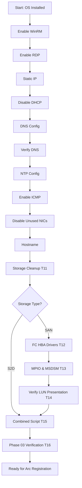

# Phase 03: OS Configuration

> **DOCUMENT CATEGORY**: Runbook   
> **SCOPE**: Post-installation OS configuration   
> **PURPOSE**: Prepare nodes for Azure Arc registration   
> **MASTER REFERENCE**: [Microsoft Learn - Prepare Active Directory](https://learn.microsoft.com/en-us/azure-stack/hci/deploy/deployment-prep-active-directory)

**Status**: Active 
**Estimated Time**: 45-60 minutes (all nodes) 
**Last Updated**: 2026-01-31

---

## Overview

This stage configures the Azure Stack HCI operating system on all cluster nodes with the settings required for Azure Local deployment. All steps can be performed remotely once WinRM is enabled.

**Objective:** Configure the Azure Local operating system on each node with network settings, remote management, and baseline configuration required for cluster deployment.

**Tasks:**

1. Enable WinRM for PowerShell remote management
2. Enable RDP for graphical remote access
3. Configure static IP addresses on management adapters
4. Disable DHCP on management adapters
5. Configure DNS server addresses
6. Verify DNS client configuration
7. Configure NTP time synchronization
8. Enable ICMP firewall rules for network diagnostics
9. Disable unused network adapters
10. Set node hostnames
11. Clear previous storage configuration (conditional — S2D redeployments only)
12. Install FC HBA drivers (conditional — SAN deployments only)
13. Configure MPIO and vendor MSDSM (conditional — SAN deployments only)
14. Verify SAN LUN presentation (conditional — SAN deployments only)
15. Optional: Run complete combined script (Tasks 02–10)
16. Phase 03 Verification

**Validation:**

- Remote management operational (WinRM and RDP)
- Static network configuration applied
- DNS resolution functional
- Time synchronization configured
- Nodes accessible and properly named

**Outcome:** All nodes configured with proper network settings, remote management enabled, and ready for Azure Arc registration (Stage 13).

---

## Configuration Workflow

---

## Steps Overview

| Step | Description | Time | Applies To |
|------|-------------|------|-----------|
| [Task 01](./task-01-enable-winrm-for-remote-management.mdx) | Enable WinRM for Remote Management | 5 min | All |
| [Task 02](./task-02-enable-rdp.mdx) | Enable RDP (Remote Desktop Protocol) | 5 min | All |
| [Task 03](./task-03-configure-static-ip-address.mdx) | Configure Static IP Address | 10 min | All |
| [Task 04](./task-04-disable-dhcp-on-management-adapter.mdx) | Disable DHCP on Management Adapter | 5 min | All |
| [Task 05](./task-05-configure-dns-servers.mdx) | Configure DNS Servers | 5 min | All |
| [Task 06](./task-06-verify-dns-client-configuration.mdx) | Verify DNS Client Configuration | 5 min | All |
| [Task 07](./task-07-configure-time-synchronization-ntp.mdx) | Configure Time Synchronization (NTP) | 5 min | All |
| [Task 08](./task-08-enable-icmp-ping.mdx) | Enable ICMP (Ping) | 5 min | All |
| [Task 09](./task-09-disable-unused-network-adapters.mdx) | Disable Unused Network Adapters | 5 min | All |
| [Task 10](./task-10-configure-hostname.mdx) | Configure Hostname | 5 min | All |
| [Task 11](./task-11-clear-previous-storage-configuration-conditional.mdx) | Clear Previous Storage Configuration | 5 min | S2D redeployment |
| [Task 12](./task-12-install-fc-hba-drivers-conditional.mdx) | Install FC HBA Drivers | 15 min | SAN only |
| [Task 13](./task-13-configure-mpio-and-vendor-msdsm-conditional.mdx) | Configure MPIO & Vendor MSDSM | 15 min | SAN only |
| [Task 14](./task-14-verify-san-lun-presentation-conditional.mdx) | Verify SAN LUN Presentation | 10 min | SAN only |
| [Task 15](./task-15-complete-combined-script-all-steps.mdx) | Complete Combined Script | N/A | Optional |
| [Task 16](./task-16-phase03-verification.mdx) | Phase 03 Verification | 10 min | All |

---

## Prerequisites

| Requirement | Description |
|-------------|-------------|
| OS installed | Stage 11 completed |
| iDRAC access | Console access for initial config |
| IP planning | Static IPs assigned per node |
| DNS servers | Enterprise DNS available |
| NTP server | Time source identified |

---

## Variables from infrastructure.yaml

The following variables are used during OS configuration:

| Variable | Description | Example |
|----------|-------------|---------|
| `NODE_XX_IP` | Static IP address for each node | `192.168.200.11` |
| `NODE_XX_NAME` | Hostname for each node | `azlocal-node01` |
| `MANAGEMENT_GATEWAY` | Default gateway IP | `192.168.200.1` |
| `MANAGEMENT_SUBNET_PREFIX` | Subnet prefix length | `24` |
| `DNS_PRIMARY_IP` | Primary DNS server IP | `192.168.200.2` |
| `DNS_SECONDARY_IP` | Secondary DNS server IP | `192.168.200.3` |
| `NTP_SERVER` | NTP server IP or hostname | `pool.ntp.org` |

---

## Network Configuration Reference

**Example Node Configuration**:

| Node | Management IP | Gateway | DNS1 | DNS2 |
|------|---------------|---------|------|------|
| NODE01 | 10.x.x.11 | 10.x.x.1 | 10.x.x.2 | 10.x.x.3 |
| NODE02 | 10.x.x.12 | 10.x.x.1 | 10.x.x.2 | 10.x.x.3 |
| NODE03 | 10.x.x.13 | 10.x.x.1 | 10.x.x.2 | 10.x.x.3 |
| NODE04 | 10.x.x.14 | 10.x.x.1 | 10.x.x.2 | 10.x.x.3 |

---

## Automation Options

**Manual**: Follow each step in sequence.

**Automated**: Use [Task 15: Combined Script](./task-15-complete-combined-script-all-steps.mdx) for full automation of Tasks 02–10.

**SAN deployments**: Run Tasks 12–14 after Task 11 before running the combined script.

---

## Validation Checklist

| Check | Required |
|-------|----------|
| WinRM responds | ✅ |
| RDP accessible | ✅ |
| Static IP configured | ✅ |
| DNS resolution works | ✅ |
| Time synchronized | ✅ |
| Hostname correct | ✅ |
| FC HBA ports visible (SAN only) | ⚙️ |
| MPIO configured (SAN only) | ⚙️ |
| Infrastructure LUNs RAW (SAN only) | ⚙️ |

---

## Next Stage

After completing OS configuration:

| All Steps Complete? | Next Action |
|---------------------|-------------|
| ✅ Yes | Proceed to [Phase 04: Arc Registration](../phase-04-arc-registration/index.mdx) |
| ❌ No | Complete remaining configuration steps |

---

**References**:
- [Microsoft Learn - Deploy Azure Stack HCI OS](https://learn.microsoft.com/en-us/azure-stack/hci/deploy/deploy-operating-system)
- [Microsoft Learn - Prepare for Deployment](https://learn.microsoft.com/en-us/azure-stack/hci/deploy/deployment-tool-prerequisites)
