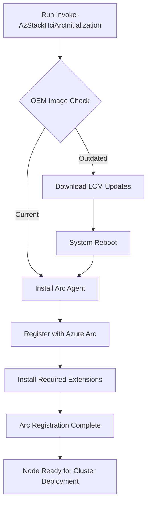

# Phase 04: Register Nodes with Azure Arc

Runbook Phase 04 — Arc Registration Azure Local

---

## Table of Contents

- [Details](#details)
- [Task 01 — Pre-Registration Environment Validation](./task-01-pre-registration-validation.mdx)
- [Task 02 — Register Cluster Nodes with Azure Arc](./task-02-register-cluster-nodes-with-azure-arc.mdx)
- [Task 03 — Monitor Bootstrap Process](./task-03-monitor-bootstrap-process.mdx)
- [Task 04 — Verify Arc Registration and Connectivity](./task-04-verify-arc-registration-and-connectivity.mdx)

---

## Details

:::info Already Arc-Registered? Skip This Phase
If you installed the OS using **[Simplified Machine Provisioning](../phase-02-os-installation/simplified-provisioning/index.mdx)**, your servers are **already registered with Azure Arc** as part of the provisioning process. You do not need to complete this phase — proceed directly to **[Phase 05: Cluster Deployment](../phase-05-cluster-deployment/index.mdx)**.
:::

> **MASTER REFERENCE**: [Register Azure Local with Azure Arc](https://learn.microsoft.com/en-us/azure/azure-local/deploy/deployment-arc-register-server-permissions?view=azloc-2604)

**Objective:** Register all cluster nodes with Azure Arc to enable Azure management plane integration and prepare for Azure Local cloud deployment.

**Tasks:**

- **Run pre-registration environment validation from each node**
- Register each node with Azure Arc
- Monitor bootstrap process and OEM image updates
- Verify Arc agent installation and connectivity
- Validate node status in Azure Portal
- Confirm Arc-enabled server management capabilities

**Validation:**

- All nodes appear in Azure Portal as Arc-enabled servers
- Arc agent services running on all nodes
- Azure management extensions deployed
- Nodes ready for Azure Local cluster deployment

**Outcome:** All cluster nodes registered with Azure Arc and visible in Azure Portal, enabling cloud-based deployment orchestration and management for Azure Local cluster deployment. Without Arc-enabled nodes, the cloud deployment orchestrator cannot communicate with the cluster. Arc also enables centralized monitoring, update management, and security posture management across hybrid infrastructure.

:::warning Critical Warning
Arc deregistration requires OS reinstallation. Verify subscription and resource group settings before proceeding. Once registered, nodes cannot be moved between subscriptions without reinstalling the operating system.
:::

---

## Arc Registration Process Flow

When you run `Invoke-AzStackHciArcInitialization`, the following sequence occurs:

### OEM Image Validation

If you purchased Integrated System or Premier solution hardware from the [Azure Local Catalog](https://aka.ms/AzureStackHCICatalog), the OS is typically preinstalled (OEM image). These images may be outdated and might not include the latest OS version or drivers.

**During Arc registration, the system automatically:**

1. **Detects outdated OEM image** — Checks if the preinstalled OS meets minimum requirements
2. **Downloads Lifecycle Manager (LCM) updates** — Retrieves required updates from Microsoft
3. **Applies updates and reboots** — System restarts automatically (may occur multiple times)
4. **Resumes registration** — After reboot, registration continues automatically
5. **Completes Arc enablement** — Installs Arc agent and required extensions

| Status | Meaning |
|--------|---------|
| `Update: InProgress` | System is downloading/applying updates before registration |
| `Succeeded` | Node successfully registered with Azure Arc |
| `Failed` | Registration failed—collect logs for troubleshooting |

:::info Expected Duration
The Arc registration script takes **20-30 minutes per node**. If an OEM image update is triggered, add an additional **15-30 minutes** for updates and reboots.
:::

---

## Steps Overview

| Step | Description | Duration | Link |
|------|-------------|----------|------|
| 1 | Pre-Registration Validation | 10-15 min | [Task 1](./task-01-pre-registration-validation.mdx) |
| 2 | Register Cluster Nodes with Azure Arc | 20-30 min/node | [Task 2](./task-02-register-cluster-nodes-with-azure-arc.mdx) |
| 3 | Monitor Bootstrap Process | 15-45 min | [Task 3](./task-03-monitor-bootstrap-process.mdx) |
| 4 | Verify Arc Registration and Connectivity | 15 min | [Task 4](./task-04-verify-arc-registration-and-connectivity.mdx) |

---

## Registration Options

Each task provides **two execution modes** to accommodate different deployment scenarios:

| Mode | Best For | Execution Context |
|------|----------|-------------------|
| **Direct** | Individual node work, lab/test | Run commands on each node directly |
| **Orchestrated** | Production multi-node | Run from management server via `variables.yml` and PowerShell remoting |

:::tip Recommended Approach
For production multi-node deployments, use the **Orchestrated** tab in each task to register, monitor, and verify all nodes from a central management server.
:::

---

## Next Steps

After completing Arc registration, proceed to:

| Next Stage | Description |
|------------|-------------|
| [Phase 05: Cluster Deployment](../phase-05-cluster-deployment/) | Deploy the Azure Local cluster via Azure Portal |

---

## References

- [Microsoft Learn - Arc Registration Workflow](https://learn.microsoft.com/en-us/azure/azure-local/deploy/deployment-arc-registration-preinstalled-os)
- [Microsoft Learn - Arc Gateway Setup](https://learn.microsoft.com/en-us/azure/azure-local/deploy/deployment-with-azure-arc-gateway)
- [Microsoft Learn - Server Permissions](https://learn.microsoft.com/en-us/azure/azure-local/deploy/deployment-arc-register-server-permissions)
