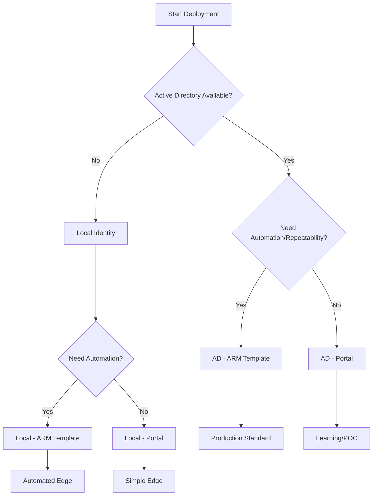

# Deployment Methods

> **DOCUMENT CATEGORY**: Reference   
> **SCOPE**: Deployment method selection guide   
> **PURPOSE**: Choose the appropriate deployment method for your environment
> **MASTER REFERENCE**: [Deploy Azure Local via Azure portal](https://learn.microsoft.com/en-us/azure/azure-local/deploy/deploy-via-portal)

**Status**: Active 
**Last Updated**: 2026-03-08

---

## Overview

Azure Local clusters can be deployed using different methods and authentication types. This guide helps you select the appropriate deployment path for your environment.

---

## Authentication Types

| Type | Description | Use Case |
|------|-------------|----------|
| **Active Directory** | Domain-joined deployment using AD accounts | Enterprise environments with existing AD infrastructure |
| **Local Identity** | Local Windows accounts with Azure Key Vault integration | Edge deployments or environments without AD |

:::warning Local Identity is in Preview
Local Identity with Azure Key Vault deployment is currently **in preview**. It is not yet generally available. Review the [Microsoft preview terms](https://azure.microsoft.com/support/legal/preview-supplemental-terms/) before using in production.
:::

:::tip Azure Local Cloud Recommendation
For Azure Local Cloud Azure Local deployments, **Active Directory with ARM Template** is the standard approach for consistency and repeatability.
:::

---

## Deployment Methods Matrix

| Authentication | Portal | ARM Template | Recommendation |
|---------------|--------|--------------|----------------|
| Active Directory | ✅ Supported | ✅ Supported | **ARM Template** for production |
| Local Identity | ✅ Supported | ✅ Supported | Portal for edge deployments |

---

## Active Directory Deployment

Enterprise deployments using domain-joined nodes with Active Directory authentication.

### Prerequisites

- Run `New-HciAdObjectsPreCreation` to create the OU, LCM user account, and block GPO inheritance at the OU level
- LCM user password must be ≥14 characters with lowercase, uppercase, numeral, and special character (cannot use `admin` as username)
- **Nodes must NOT be domain-joined before deployment** — all nodes must be in workgroup state
- DNS resolves the AD domain FQDN from all nodes
- WinRM (WS-MAN port 5985) open bi-directionally between all nodes for inter-node cluster communication
- If a firewall exists between Azure Local nodes and AD, firewall rules must permit AD communication

### Deployment Options

| Method | Description | Link |
|--------|-------------|------|
| **Portal** | Interactive wizard-based deployment | [AD - Portal Deployment](./active-directory/portal-instructions.mdx) |
| **ARM Template** | Infrastructure-as-code deployment | [AD - ARM Template](./active-directory/arm-template-instructions.mdx) |

---

## Local Identity Deployment

Deployments using local Windows accounts, suitable for edge scenarios or environments without Active Directory.

### Prerequisites

- Non-built-in local administrator account (NOT the built-in `Administrator`) with identical credentials on ALL nodes — added to local Administrators group on each node
- Account password must be ≥14 characters with lowercase, uppercase, numeral, and special character
- Static IP addresses configured on all nodes — DHCP is not supported
- DNS server with Host A records for each node AND for the cluster system itself
- WinRM (WS-MAN port 5985) open bi-directionally between all nodes for inter-node cluster communication
- SSH enabled on each node (required for Azure portal Arc-based remote access)
- Azure Key Vault accessible (existing KV, or created during the portal deployment wizard)

:::warning Windows Admin Center not supported
**Windows Admin Center is not supported** in Local Identity with Key Vault environments. Use PowerShell or the Azure portal for administrative tasks.
:::

### Deployment Options

| Method | Description | Link |
|--------|-------------|------|
| **Portal** | Interactive wizard-based deployment | [Local Identity - Portal](./local-identity/portal-instructions.mdx) |
| **ARM Template** | Infrastructure-as-code deployment | [Local Identity - ARM Template](./local-identity/arm-template-instructions.mdx) |

---

## Decision Tree

---

## Method Comparison

### Portal Deployment

| Aspect | Description |
|--------|-------------|
| **Pros** | Visual interface, guided wizard, real-time validation |
| **Cons** | Manual, not repeatable, requires interactive session |
| **Best For** | Learning, troubleshooting, single deployments |

### ARM Template Deployment

| Aspect | Description |
|--------|-------------|
| **Pros** | Repeatable, version controlled, CI/CD integration |
| **Cons** | Requires template knowledge, initial setup time |
| **Best For** | Production, multi-site, enterprise deployments |

---

## Quick Start

### Azure Local Cloud Standard Deployment

For standard Azure Local Cloud Azure Local deployments:

1. Complete [Phase 14: Arc Registration](../../phase-04-arc-registration/index.mdx)
2. Use [Active Directory - ARM Template](./active-directory/arm-template-instructions.mdx)
3. Follow the deployment procedure with Azure Local Cloud templates
4. Proceed to [Phase 16: Post-Deployment](../../phase-06-post-deployment/index.mdx)

---

## Navigation

| Previous | Up | Next |
|----------|-----|------|
| [Phase 14: Arc Registration](../../phase-04-arc-registration/) | [Phase 15: Cluster Deployment](../index.mdx) | [Phase 16: Post-Deployment](../../phase-06-post-deployment/) |

---

**References**:
- [Microsoft Learn - Deploy via Portal](https://learn.microsoft.com/en-us/azure/azure-local/deploy/deploy-via-portal)
- [Microsoft Learn - Deploy via ARM Template](https://learn.microsoft.com/en-us/azure/azure-local/deploy/deployment-azure-resource-manager-template)
- [Microsoft Learn - Local Identity with Key Vault](https://learn.microsoft.com/en-us/azure/azure-local/deploy/deployment-local-identity-with-key-vault)
- [Microsoft Learn - Prepare Active Directory](https://learn.microsoft.com/en-us/azure/azure-local/deploy/deployment-prep-active-directory)
- [Microsoft Learn - Firewall Requirements](https://learn.microsoft.com/en-us/azure/azure-local/concepts/firewall-requirements)
