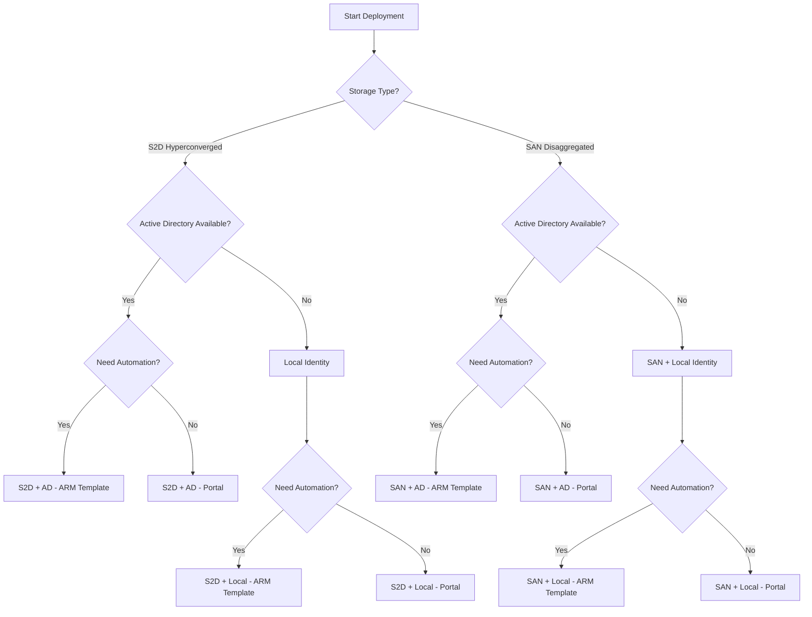

# Deployment Methods

> **DOCUMENT CATEGORY**: Reference   
> **SCOPE**: Deployment method selection guide   
> **PURPOSE**: Choose the appropriate deployment method for your environment
> **MASTER REFERENCE**: [Deploy Azure Local via Azure portal](https://learn.microsoft.com/en-us/azure/azure-local/deploy/deploy-via-portal?view=azloc-2604)

**Status**: Active 
**Last Updated**: 2026-03-08

---

## Overview

Azure Local clusters can be deployed using different methods and authentication types. This guide helps you select the appropriate deployment path for your environment.

---

## Authentication Types

| Type | Description | Use Case |
|------|-------------|----------|
| **Active Directory** | Domain-joined deployment using AD accounts | Enterprise environments with existing AD infrastructure |
| **Local Identity** | Local Windows accounts with Azure Key Vault integration | Edge deployments or environments without AD |

:::tip Azure Local Cloud Recommendation
For Azure Local Cloud Azure Local deployments, **Active Directory with ARM Template** is the standard approach for consistency and repeatability.
:::

---

## Storage Topology

| Topology | Description | Use Case |
|----------|-------------|----------|
| **Storage Spaces Direct (S2D)** | Hyperconverged — local NVMe drives managed by Windows S2D | New deployments without existing SAN investment |
| **Disaggregated SAN** | External SAN array via Fibre Channel | Environments with existing SAN infrastructure or specific storage requirements |

:::tip S2D is the default
Storage Spaces Direct is the recommended topology for most Azure Local Cloud deployments. Choose SAN only when there is an existing Fibre Channel SAN that the customer explicitly wants to use.
:::

### SAN Pre-Deployment Requirements

If using SAN disaggregated topology, complete Phase 03 Tasks 12–14 **before** running the deployment wizard:

1. [Task 12 — Install FC HBA Drivers](../../phase-03-os-configuration/task-12-install-fc-hba-drivers-conditional.mdx)
2. [Task 13 — Configure MPIO & MSDSM](../../phase-03-os-configuration/task-13-configure-mpio-and-vendor-msdsm-conditional.mdx)
3. [Task 14 — Verify SAN LUN Presentation](../../phase-03-os-configuration/task-14-verify-san-lun-presentation-conditional.mdx)

:::danger Infrastructure LUNs must be RAW
The SAN infrastructure volume (≥250 GB) and performance history LUN (≥20 GB) must remain **uninitialized (RAW)** until the deployment wizard claims them. Do not initialize these LUNs before running the wizard.
:::

:::warning Post-Arc zoning window
FC zoning is typically completed in two steps:
1. **Before deployment**: Zone server HBA ports to SAN array target ports
2. **After Arc registration**: Add the infrastructure volume and performance history LUNs to the host group

Coordinate timing with your SAN administrator.
:::

---

## Deployment Methods Matrix

### Storage Spaces Direct (S2D) — Hyperconverged

| Authentication | Portal | ARM Template | Recommendation |
|---------------|--------|--------------|----------------|
| Active Directory | ✅ Supported | ✅ Supported | **ARM Template** for production |
| Local Identity | ✅ Supported | ✅ Supported | Portal for edge deployments |

### Storage Area Network (SAN) — Disaggregated

| Authentication | Portal | ARM Template | Recommendation |
|---------------|--------|--------------|----------------|
| Active Directory | ✅ Supported | ✅ Supported | **ARM Template** for production |
| Local Identity | ✅ Supported | ✅ Supported | Portal for edge deployments |

:::info Choosing Storage Type
- **S2D (Hyperconverged)**: Storage is local to each compute node. Scale compute and storage together. Up to 16 nodes.
- **SAN (Disaggregated)**: External SAN provides storage via Fiber Channel. Scale compute and storage independently. Up to 64 nodes.

For SAN deployment details, see [SAN (Disaggregated) Deployment](./san/index.mdx).
:::

---

## Active Directory Deployment (S2D and SAN)

Enterprise deployments using domain-joined nodes with Active Directory authentication.

### Prerequisites

- Run `New-HciAdObjectsPreCreation` to create the OU, LCM user account, and block GPO inheritance at the OU level
- LCM user password must be ≥14 characters with lowercase, uppercase, numeral, and special character (cannot use `admin` as username)
- **Nodes must NOT be domain-joined before deployment** — all nodes must be in workgroup state
- DNS resolves the AD domain FQDN from all nodes
- WinRM (WS-MAN port 5985) open bi-directionally between all nodes for inter-node cluster communication
- If a firewall exists between Azure Local nodes and AD, firewall rules must permit AD communication

:::info Applies to both storage topologies
These Active Directory deployment steps apply to both S2D and SAN disaggregated deployments. Select the appropriate runbook for your topology below.
:::

### Deployment Options

| Method | S2D Runbook | SAN Runbook |
|--------|-------------|-------------|
| **Portal** | [AD/S2D — Portal](./s2d/active-directory/portal-instructions.mdx) | [AD/SAN — Portal](./san/active-directory/portal-instructions.mdx) |
| **ARM Template** | [AD/S2D — ARM Template](./s2d/active-directory/arm-template-instructions.mdx) | [AD/SAN — ARM Template](./san/active-directory/arm-template-instructions.mdx) |

---

## Local Identity Deployment (S2D and SAN)

Deployments using local Windows accounts, suitable for edge scenarios or environments without Active Directory.

### Prerequisites

- Non-built-in local administrator account (NOT the built-in `Administrator`) with identical credentials on ALL nodes — added to local Administrators group on each node
- Account password must be ≥14 characters with lowercase, uppercase, numeral, and special character
- Static IP addresses configured on all nodes — DHCP is not supported
- DNS server with Host A records for each node AND for the cluster system itself
- WinRM (WS-MAN port 5985) open bi-directionally between all nodes for inter-node cluster communication
- SSH enabled on each node (required for Azure portal Arc-based remote access)
- Azure Key Vault accessible (existing KV, or created during the portal deployment wizard)

:::warning Windows Admin Center not supported
**Windows Admin Center is not supported** in Local Identity with Key Vault environments. Use PowerShell or the Azure portal for administrative tasks.
:::

:::info Applies to both storage topologies
These Local Identity deployment steps apply to both S2D and SAN disaggregated deployments. Select the appropriate runbook for your topology below.
:::

### Deployment Options

| Method | S2D Runbook | SAN Runbook |
|--------|-------------|-------------|
| **Portal** | [LI/S2D — Portal](./s2d/local-identity/portal-instructions.mdx) | [LI/SAN — Portal](./san/local-identity/portal-instructions.mdx) |
| **ARM Template** | [LI/S2D — ARM Template](./s2d/local-identity/arm-template-instructions.mdx) | [LI/SAN — ARM Template](./san/local-identity/arm-template-instructions.mdx) |

---

## Decision Tree

---

## SAN (Disaggregated) Deployment

Deployments using external Storage Area Network (SAN) storage via Fiber Channel. The disaggregated architecture separates compute and storage, supporting up to 64 nodes.

For full details, see [SAN (Disaggregated) Deployment](./san/index.mdx).

### Deployment Options

| Identity | Method | Link |
|----------|--------|------|
| **Active Directory** | Portal | [AD — Portal (SAN)](./san/active-directory/portal-instructions.mdx) |
| **Active Directory** | ARM Template | [AD — ARM Template (SAN)](./san/active-directory/arm-template-instructions.mdx) |
| **Local Identity** | Portal | [Local Identity — Portal (SAN)](./san/local-identity/portal-instructions.mdx) |
| **Local Identity** | ARM Template | [Local Identity — ARM Template (SAN)](./san/local-identity/arm-template-instructions.mdx) |

---

## Method Comparison

### Portal Deployment

| Aspect | Description |
|--------|-------------|
| **Pros** | Visual interface, guided wizard, real-time validation |
| **Cons** | Manual, not repeatable, requires interactive session |
| **Best For** | Learning, troubleshooting, single deployments |

### ARM Template Deployment

| Aspect | Description |
|--------|-------------|
| **Pros** | Repeatable, version controlled, CI/CD integration |
| **Cons** | Requires template knowledge, initial setup time |
| **Best For** | Production, multi-site, enterprise deployments |

---

## Quick Start

### Azure Local Cloud Standard Deployment (S2D)

For standard Azure Local Cloud Azure Local deployments with Storage Spaces Direct:

1. Complete [Phase 14: Arc Registration](../../phase-04-arc-registration/index.mdx)
2. Use [AD/S2D — ARM Template](./s2d/active-directory/arm-template-instructions.mdx)
3. Follow the deployment procedure with Azure Local Cloud templates
4. Proceed to [Phase 16: Post-Deployment](../../phase-06-post-deployment/index.mdx)

### SAN Disaggregated Deployment

For deployments using an external Fibre Channel SAN:

1. Complete Phase 03 Tasks 12–14 (FC HBA, MPIO, LUN verification)
2. Complete [Phase 14: Arc Registration](../../phase-04-arc-registration/index.mdx)
3. Use [AD/SAN — Portal](./san/active-directory/portal-instructions.mdx) or [AD/SAN — ARM Template](./san/active-directory/arm-template-instructions.mdx)
4. Proceed to [Phase 16: Post-Deployment](../../phase-06-post-deployment/index.mdx)

---

## Navigation

| Previous | Up | Next |
|----------|-----|------|
| [Phase 14: Arc Registration](../../phase-04-arc-registration/) | [Phase 15: Cluster Deployment](../index.mdx) | [Phase 16: Post-Deployment](../../phase-06-post-deployment/) |

---

**References**:
- [Microsoft Learn - Deploy via Portal](https://learn.microsoft.com/en-us/azure/azure-local/deploy/deploy-via-portal)
- [Microsoft Learn - Deploy via ARM Template](https://learn.microsoft.com/en-us/azure/azure-local/deploy/deployment-azure-resource-manager-template)
- [Microsoft Learn - Local Identity with Key Vault](https://learn.microsoft.com/en-us/azure/azure-local/deploy/deployment-local-identity-with-key-vault)
- [Microsoft Learn - Prepare Active Directory](https://learn.microsoft.com/en-us/azure/azure-local/deploy/deployment-prep-active-directory)
- [Microsoft Learn - Firewall Requirements](https://learn.microsoft.com/en-us/azure/azure-local/concepts/firewall-requirements)
