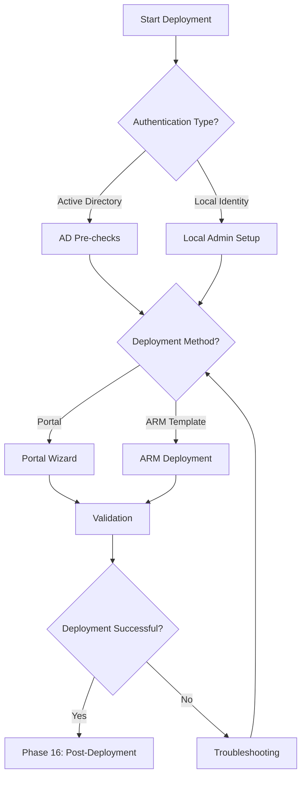

# Phase 05: Cluster Deployment

> **DOCUMENT CATEGORY**: Runbook 
> **SCOPE**: Azure Local cluster deployment 
> **PURPOSE**: Deploy the cluster through Azure Portal or ARM templates 
> **MASTER REFERENCE**: [Microsoft Learn - Deploy Azure Local](https://learn.microsoft.com/en-us/azure/azure-local/deploy/deploy-via-portal)

**Status**: Active 
**Estimated Time**: 1.5-3 hours 
**Last Updated**: 2026-03-08

---

## Overview

This stage deploys the Azure Local cluster using the configured infrastructure. Deployment can be performed through the Azure Portal (GUI-based) or ARM templates (infrastructure-as-code). Azure Local Cloud supports both Active Directory and Local Identity authentication methods.

---

## Deployment Methods

| Method | Authentication | Use Case |
|--------|---------------|----------|
| [Portal - Active Directory](./deployment-methods/active-directory/portal-instructions.mdx) | Domain-joined | Standard enterprise deployment |
| [ARM Template - Active Directory](./deployment-methods/active-directory/arm-template-instructions.mdx) | Domain-joined | Automated/repeatable deployment |
| [Portal - Local Identity](./deployment-methods/local-identity/portal-instructions.mdx) | Local accounts | Edge/disconnected scenarios |
| [ARM Template - Local Identity](./deployment-methods/local-identity/arm-template-instructions.mdx) | Local accounts | Automated edge deployment |

:::tip Azure Local Cloud Standard
For Azure Local Cloud Azure Local Anywhere deployments, **Active Directory with ARM Template** is the recommended approach for consistency and repeatability.
:::

---

## Prerequisites

### All Deployment Methods

| Requirement | Validation |
|-------------|------------|
| Arc registration complete (Phase 04) | All nodes show "Connected" in Azure Portal |
| Network infrastructure configured | Management, storage, and compute networks ready |
| Required Azure permissions | Contributor + User Access Administrator on resource group |
| Storage infrastructure ready | Physical disks and enclosures configured |

### Active Directory Deployments Only

| Requirement | Validation |
|-------------|------------|
| AD pre-created with `New-HciAdObjectsPreCreation` | OU exists, LCM user created in OU, GPO inheritance blocked at OU level |
| Nodes NOT pre-joined to domain | `(Get-WmiObject Win32_ComputerSystem).Domain` returns `WORKGROUP` |
| DNS resolves the AD domain FQDN from all nodes | `Resolve-DnsName <domain.fqdn>` succeeds on each node |

### Local Identity Deployments Only

| Requirement | Validation |
|-------------|------------|
| Non-built-in local admin account with identical credentials on ALL nodes | Account is NOT the built-in Administrator; login succeeds on each node |
| Azure Key Vault available | Existing KV accessible, or will be created during portal deployment |
| DNS server with zone configured for cluster nodes | `Resolve-DnsName <node-fqdn>` succeeds for each node |

---

## Deployment Workflow

---

## Azure Portal Deployment Overview

The Azure Portal deployment wizard guides you through:

1. **Basics** - Subscription, resource group, cluster name, region
2. **Configuration** - Node configuration, witness, and storage settings
3. **Networking** - Management, compute, and storage network settings
4. **Management** - Update settings, key vault integration
5. **Tags** - Resource tagging for governance
6. **Validation** - Pre-deployment checks
7. **Review + Create** - Final review and deployment

---

## ARM Template Deployment Overview

ARM template deployments provide:

- **Repeatability** - Consistent deployments across environments
- **Version Control** - Track infrastructure changes in Git
- **Automation** - Integrate with CI/CD pipelines
- **Compliance** - Audit trail of infrastructure changes

:::info Azure Local Cloud ARM Templates
Azure Local Cloud parameter templates are maintained in the Azure Local Toolkit:

**Toolkit location:** `configs/azure/arm-templates/04-cluster-deployment/`
- `azuredeploy.parameters.ad.json` — Active Directory authentication
- `azuredeploy.parameters.local-identity.json` — Local Identity authentication

**Microsoft official template:** Pull at deploy time from the [Azure Quickstart Templates](https://github.com/Azure/azure-quickstart-templates/tree/master/quickstarts/microsoft.azurestackhci/create-cluster) repository. Do not modify the main template — customize only via the parameters file.
:::

---

## Estimated Deployment Time

| Phase | Duration |
|-------|----------|
| Pre-deployment validation | 15-30 minutes |
| Cluster deployment | 45-90 minutes |
| Extension installation | 15-30 minutes |
| Post-deployment validation | 15-30 minutes |
| **Total** | **1.5-3 hours** |

---

## Next Steps

Select your deployment method:

| Authentication | Method | Link |
|---------------|--------|------|
| Active Directory | Portal | [Portal Instructions](./deployment-methods/active-directory/portal-instructions.mdx) |
| Active Directory | ARM Template | [ARM Template Instructions](./deployment-methods/active-directory/arm-template-instructions.mdx) |
| Local Identity | Portal | [Portal Instructions](./deployment-methods/local-identity/portal-instructions.mdx) |
| Local Identity | ARM Template | [ARM Template Instructions](./deployment-methods/local-identity/arm-template-instructions.mdx) |

After completing cluster deployment, proceed to [Phase 16: Post Deployment](../phase-06-post-deployment/index.mdx).

---

## Navigation

| Previous | Up | Next |
|----------|-----|------|
| [Phase 14: Arc Registration](../phase-04-arc-registration/) | [Cluster Deployment Index](../index.mdx) | [Phase 16: Post-Deployment](../phase-06-post-deployment/) |

---

**References**:
- [Microsoft Learn - Deploy via Portal](https://learn.microsoft.com/en-us/azure/azure-local/deploy/deploy-via-portal)
- [Microsoft Learn - Deploy via ARM Template](https://learn.microsoft.com/en-us/azure/azure-local/deploy/deploy-via-arm)
- [Microsoft Learn - Deployment Prerequisites](https://learn.microsoft.com/en-us/azure/azure-local/deploy/deployment-prerequisites)

