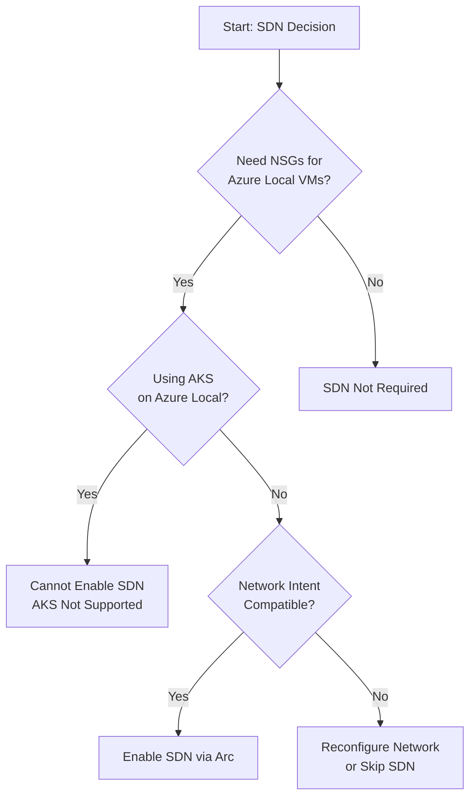

# Phase 01: SDN Operations (Optional)

> **DOCUMENT CATEGORY**: Runbook   
> **SCOPE**: SDN prerequisites validation and NSG configuration   
> **PURPOSE**: Validate readiness before SDN deployment and configure NSGs after enablement   
> **MASTER REFERENCE**: [Microsoft Learn - SDN Overview](https://learn.microsoft.com/en-us/azure/azure-local/concepts/sdn-overview)

:::tip SDN Deployment
The actual SDN enablement procedure is in [Post-Deployment: Deploy SDN](../../04-cluster-deployment/phase-06-post-deployment/task-01-deploy-sdn.mdx). This section covers the **before** (prerequisites) and **after** (NSG configuration) steps.
:::

**Status**: Active

---

## Overview

Software Defined Networking (SDN) on Azure Local provides centralized network configuration and management through Azure Arc integration. SDN enables you to dynamically create, secure, and connect your network to meet the evolving needs of your applications.

:::warning Important: Legacy SDN Deployment Methods Not Supported
**The legacy SDN deployment methods are NOT supported on Azure Local 2601 and later:**

- ❌ SDN Express PowerShell scripts
- ❌ Network Controller VMs (NC is now a Failover Cluster service)
- ❌ Software Load Balancer (SLB) VMs
- ❌ Gateway VMs (VPN, L3, GRE)
- ❌ Virtual Networks (HNV)
- ❌ Windows Admin Center SDN deployment
- ❌ System Center Virtual Machine Manager SDN deployment

**Azure Local uses "SDN enabled by Azure Arc"** - a simplified model where the Network Controller runs as a Failover Cluster service integrated with the Azure Arc control plane.
:::

## SDN Management Methods

Azure Local supports two mutually exclusive SDN management approaches:

| Method | Description | Use Case |
|--------|-------------|----------|
| **SDN enabled by Azure Arc** | Network Controller as Failover Cluster service, managed via Azure | Azure Local 2601+ (Recommended) |
| **SDN managed by on-premises tools** | Traditional SDN with NC VMs, managed via WAC/SDN Express | Windows Server, Azure Local 2311.2 (Legacy) |

:::danger Do Not Mix Management Methods
If SDN is enabled by Arc, you **must not** manage it via on-premises tools (WAC, SDN Express).

If SDN was deployed using on-premises tools, you **must not** run `Add-EceFeature` to enable Arc integration.

These methods are mutually exclusive and will cause conflicts.
:::

## SDN Enabled by Azure Arc - Features

### Supported Resources

| Resource | Management Interface |
|----------|---------------------|
| Logical Networks | Azure Portal, Azure CLI, ARM Templates |
| VM NICs | Azure Portal, Azure CLI, ARM Templates |
| Network Security Groups (NSGs) | Azure Portal, Azure CLI, ARM Templates |

### Unsupported Resources

The following traditional SDN resources are **NOT available** with SDN enabled by Arc:

| Resource | Status |
|----------|--------|
| Virtual Networks (HNV) | ❌ Not Supported |
| Software Load Balancers (SLB) | ❌ Not Supported |
| VPN Gateways | ❌ Not Supported |
| L3 Gateways | ❌ Not Supported |
| GRE Gateways | ❌ Not Supported |

### Unsupported Workloads

| Workload | Status |
|----------|--------|
| AKS on Azure Local | ❌ Not Supported with SDN |
| Multi-cast workloads | ❌ Not Supported (unicast only) |

## Recommendation

:::tip Position on SDN
**We recommend enabling SDN** for Azure Local deployments to leverage:

- **Network Security Groups (NSGs)** - Micro-segmentation for Azure Local VMs
- **Logical Network Management** - Centralized network management via Azure Portal
- **Azure Arc Integration** - Consistent management experience with Azure

However, understand the limitations before enabling:
- No SLB or Gateway support (use Azure Load Balancer, Azure VPN/ExpressRoute instead)
- Only applies to Azure Local VMs deployed from Azure interfaces
- Does not support AKS workloads
:::

## Supported Network Intent Patterns

SDN enabled by Arc supports specific Network ATC intent configurations:

### Pattern 1: Group All Traffic (Single Intent)
- Single or multi-node clusters
- **Requires**: Switched storage connectivity
- Single virtual switch for SDN resources

### Pattern 2: Management + Compute Intent with Separate Storage
- Single or multi-node clusters
- Supports switched or switchless storage (up to 4 nodes)
- 5+ nodes require switched storage

### Pattern 3: Custom Disaggregated (Up to 3 Intents)
- Separate management, compute, and storage intents
- Requires sufficient network adapter ports
- Supports switched or switchless storage (up to 4 nodes)

### Unsupported Intent Configurations

| Configuration | Status |
|---------------|--------|
| More than 3 intents | ❌ Not Supported |
| Combined compute + storage intents | ❌ Not Supported |
| Standalone compute intent (single node) | ❌ Not Supported |
| 3 intents on 2-node or 3-node switchless | ❌ Not Supported |

## Steps in This Stage

| Step | Title | Description |
|------|-------|-------------|
| 1 | [Validate SDN Prerequisites](task-01-validate-sdn-prerequisites.mdx) | Verify network intent compatibility and requirements |
| 2 | [Configure Network Security Groups](task-02-configure-network-security-groups.mdx) | Create and apply NSGs to logical networks and VM NICs |

## Prerequisites

Before enabling SDN:

- [ ] Azure Local cluster deployed and operational (version 2601+ with OS 26100.xxxx)
- [ ] Cluster registered with Azure Arc
- [ ] Network ATC configured with compatible intent pattern
- [ ] Administrative access to cluster nodes
- [ ] Azure portal access for NSG management

## Decision Workflow

## Related Documentation

- [SDN Overview - Microsoft Learn](https://learn.microsoft.com/en-us/azure/azure-local/concepts/sdn-overview)
- [Enable SDN Integration](https://learn.microsoft.com/en-us/azure/azure-local/deploy/enable-sdn-integration)
- [Network ATC Intents](https://learn.microsoft.com/en-us/azure/azure-local/upgrade/install-enable-network-atc)