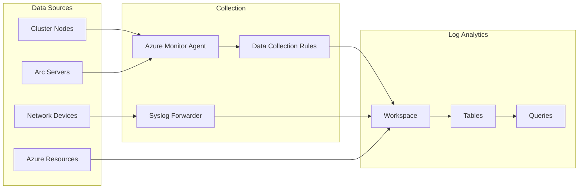

import Tabs from '@theme/Tabs';
import TabItem from '@theme/TabItem';

# Task 01: Configure Log Analytics Workspace

[](./index.mdx)
[](https://learn.microsoft.com/en-us/azure/azure-local/)

> **DOCUMENT CATEGORY**: Runbook 
> **SCOPE**: Log Analytics workspace configuration 
> **PURPOSE**: Create the foundational workspace for all monitoring data collection 
> **MASTER REFERENCE**: [Microsoft Learn - Log Analytics Workspace](https://learn.microsoft.com/en-us/azure/azure-monitor/logs/log-analytics-workspace-overview)

**Status**: Active

---

The Log Analytics workspace is the **foundation** for all Azure Local monitoring. It stores performance metrics, event logs, security data, and custom logs from cluster nodes, network devices, and Arc-enabled resources. This workspace must be created **before** enabling HCI Insights, Azure Monitor Agent, or any alerting.

## Prerequisites

| Requirement | Description | Validation |
|-------------|-------------|------------|
| Azure Subscription | Active subscription with billing | Portal access confirmed |
| Resource Group | `{{AZURE_RESOURCE_GROUP}}` exists | `az group show` |
| RBAC Permissions | Contributor or Owner on resource group | Role assignment verified |
| Region Selection | Same region as Azure Local cluster | Latency considerations |

## Overview



## Configuration Options

<Tabs groupId="deployment-method">
<TabItem value="manual" label="Azure Portal" default>

#### Step 1.1: Create Log Analytics Workspace

1. Navigate to **Azure Portal** → **Log Analytics workspaces**
2. Click **+ Create**
3. Configure workspace settings:

| Setting | Value | Notes |
|---------|-------|-------|
| **Subscription** | `{{AZURE_SUBSCRIPTION_NAME}}` | Select target subscription |
| **Resource Group** | `{{AZURE_RESOURCE_GROUP}}` | Use existing monitoring RG |
| **Name** | `{{LOG_ANALYTICS_WORKSPACE_NAME}}` | e.g., `law-azl-{{SITE_CODE}}-prod-01` |
| **Region** | `{{AZURE_REGION}}` | Same as cluster resources |

4. Click **Review + Create** → **Create**

#### Step 1.2: Configure Data Retention

1. Open the workspace → **Settings** → **Usage and estimated costs**
2. Click **Data Retention**
3. Set retention period:
 - **Default**: 30 days (free)
 - **Recommended**: 90 days for operational data
 - **Compliance**: 365+ days for audit requirements

#### Step 1.3: Configure Access Control

1. Navigate to workspace → **Access control (IAM)**
2. Add role assignments:

| Role | Principal | Purpose |
|------|-----------|---------|
| Log Analytics Contributor | Azure Local Cloud Admin Group | Full management |
| Log Analytics Reader | Operations Team | View logs and queries |
| Monitoring Contributor | Automation Account | DCR management |

</TabItem>
<TabItem value="direct" label="Direct Script (On Node)">

```bash
# Variables
SUBSCRIPTION_ID="{{AZURE_SUBSCRIPTION_ID}}"
RESOURCE_GROUP="{{AZURE_RESOURCE_GROUP}}"
WORKSPACE_NAME="{{LOG_ANALYTICS_WORKSPACE_NAME}}"
LOCATION="{{AZURE_REGION}}"
RETENTION_DAYS=90

# Set subscription context
az account set --subscription "$SUBSCRIPTION_ID"

# Create Log Analytics Workspace
az monitor log-analytics workspace create \
 --resource-group "$RESOURCE_GROUP" \
 --workspace-name "$WORKSPACE_NAME" \
 --location "$LOCATION" \
 --retention-time "$RETENTION_DAYS" \
 --sku PerGB2018 \
 --tags \
 Environment=Production \
 Application=AzureLocal \
 ManagedBy=Azure Local Cloud

# Get workspace ID and key for agent configuration
WORKSPACE_ID=$(az monitor log-analytics workspace show \
 --resource-group "$RESOURCE_GROUP" \
 --workspace-name "$WORKSPACE_NAME" \
 --query customerId -o tsv)

WORKSPACE_KEY=$(az monitor log-analytics workspace get-shared-keys \
 --resource-group "$RESOURCE_GROUP" \
 --workspace-name "$WORKSPACE_NAME" \
 --query primarySharedKey -o tsv)

echo "Workspace ID: $WORKSPACE_ID"
echo "Workspace Key: $WORKSPACE_KEY"
```

</TabItem>
<TabItem value="standalone" label="Standalone Script">

```powershell
# Variables from variables.yml
$SubscriptionId = "{{AZURE_SUBSCRIPTION_ID}}"
$ResourceGroup = "{{AZURE_RESOURCE_GROUP}}"
$WorkspaceName = "{{LOG_ANALYTICS_WORKSPACE_NAME}}"
$Location = "{{AZURE_REGION}}"
$RetentionDays = 90

# Connect to Azure
Connect-AzAccount -Subscription $SubscriptionId

# Create Log Analytics Workspace
$workspace = New-AzOperationalInsightsWorkspace `
 -ResourceGroupName $ResourceGroup `
 -Name $WorkspaceName `
 -Location $Location `
 -Sku PerGB2018 `
 -RetentionInDays $RetentionDays `
 -Tag @{
 Environment = "Production"
 Application = "AzureLocal"
 ManagedBy = "Azure Local Cloud"
 }

# Get workspace credentials
$workspaceId = $workspace.CustomerId
$workspaceKey = (Get-AzOperationalInsightsWorkspaceSharedKey `
 -ResourceGroupName $ResourceGroup `
 -Name $WorkspaceName).PrimarySharedKey

Write-Host "Workspace ID: $workspaceId"
Write-Host "Workspace Key: $workspaceKey"

# Store for later use
$workspaceInfo = @{
 WorkspaceId = $workspaceId
 ResourceId = $workspace.ResourceId
 Name = $WorkspaceName
}
$workspaceInfo | ConvertTo-Json | Out-File "$env:TEMP\law-config.json"
```

</TabItem>
</Tabs>

## Configure Data Sources

After creating the workspace, configure the data sources that will send data:

### Windows Event Logs

Navigate to **Workspace** → **Settings** → **Agents** → **Windows event logs**:

| Log Name | Event Levels |
|----------|-------------|
| `Microsoft-Windows-Health/Operational` | Error, Warning, Information |
| `Microsoft-Windows-SDDC-Management/Operational` | Error, Warning, Information |
| `System` | Error, Warning |
| `Application` | Error, Warning |
| `Microsoft-Windows-Hyper-V-VMMS-Admin` | Error, Warning |

### Performance Counters

Configure performance counters for HCI Insights compatibility:

| Counter | Sample Interval |
|---------|----------------|
| `Memory(*)\Available Bytes` | 60 seconds |
| `Network Interface(*)\Bytes Total/sec` | 60 seconds |
| `Processor(_Total)\% Processor Time` | 60 seconds |
| `RDMA Activity(*)\RDMA Inbound Bytes/sec` | 60 seconds |
| `RDMA Activity(*)\RDMA Outbound Bytes/sec` | 60 seconds |
| `Cluster CSV File System(*)\Read Latency` | 60 seconds |
| `Cluster CSV File System(*)\Write Latency` | 60 seconds |

## Data Collection Endpoint (DCE)

For Azure Monitor Agent to send data, create a Data Collection Endpoint:

```powershell
# Create Data Collection Endpoint
$dce = New-AzDataCollectionEndpoint `
 -ResourceGroupName $ResourceGroup `
 -Name "dce-{{SITE_CODE}}-azl-01" `
 -Location $Location `
 -NetworkAclsPublicNetworkAccess "Enabled"

Write-Host "DCE Resource ID: $($dce.Id)"
```

> **Important**: Keep the DCE in the **same region** as the Log Analytics workspace to avoid data ingestion issues.

## Validation

### Verify Workspace Creation

```powershell
# Verify workspace exists and is accessible
$workspace = Get-AzOperationalInsightsWorkspace `
 -ResourceGroupName "{{AZURE_RESOURCE_GROUP}}" `
 -Name "{{LOG_ANALYTICS_WORKSPACE_NAME}}"

if ($workspace.ProvisioningState -eq "Succeeded") {
 Write-Host "✅ Workspace created successfully" -ForegroundColor Green
 Write-Host " Resource ID: $($workspace.ResourceId)"
 Write-Host " Customer ID: $($workspace.CustomerId)"
 Write-Host " Retention: $($workspace.RetentionInDays) days"
} else {
 Write-Host "❌ Workspace creation failed: $($workspace.ProvisioningState)" -ForegroundColor Red
}
```

### Test Query Capability

```powershell
# Run a simple query to verify connectivity
$query = "Heartbeat | take 5"
$result = Invoke-AzOperationalInsightsQuery `
 -WorkspaceId $workspace.CustomerId `
 -Query $query

Write-Host "Query executed successfully. Results: $($result.Results.Count)"
```

## Troubleshooting

| Issue | Possible Cause | Resolution |
|-------|---------------|------------|
| Workspace creation fails | Insufficient permissions | Verify Contributor role on resource group |
| No data appearing | DCR not configured | Complete Step 2 (Azure Monitor Agent) |
| Query timeout | Large data volume | Narrow time range or add filters |
| Region mismatch errors | DCE in different region | Create DCE in same region as workspace |

## Variables Reference

| Variable | Description | Example |
|----------|-------------|---------|
| `{{AZURE_SUBSCRIPTION_ID}}` | Target subscription ID | `12345678-1234-...` |
| `{{AZURE_RESOURCE_GROUP}}` | Monitoring resource group | `rg-azl-prod-monitoring` |
| `{{LOG_ANALYTICS_WORKSPACE_NAME}}` | Workspace name | `law-azl-dal-prod-01` |
| `{{AZURE_REGION}}` | Azure region | `eastus2` |
| `{{SITE_CODE}}` | Site identifier | `dal` |

## Next Steps

After configuring the Log Analytics workspace:

1. ➡️ **[Task 2: Configure Azure Monitor Agent](./task-02-configure-azure-monitor-agent.mdx)** — Deploy AMA to cluster nodes
2. Enable data collection rules for performance and event data
3. Verify data is flowing to the workspace before enabling Insights
