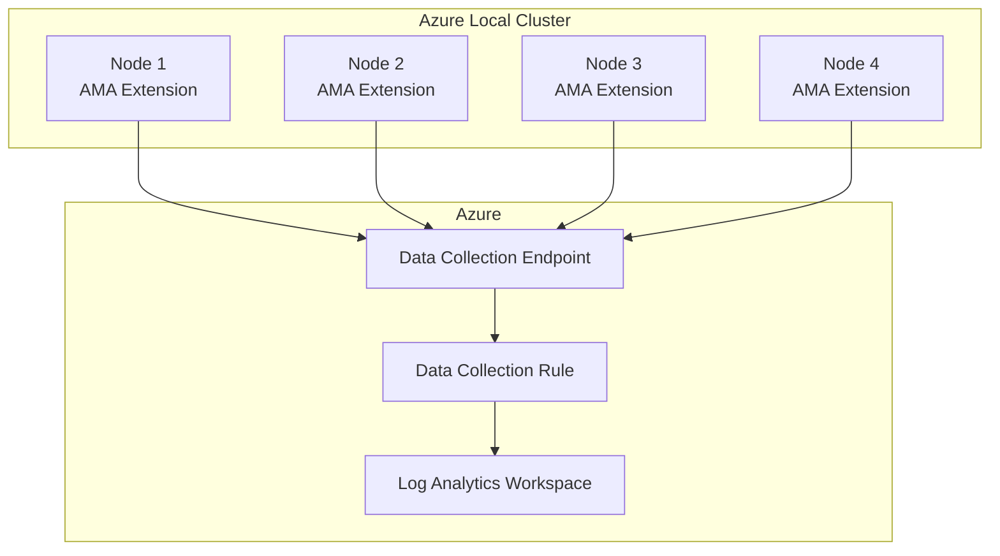

import Tabs from '@theme/Tabs';
import TabItem from '@theme/TabItem';

# Task 02: Configure Azure Monitor Agent

[](./index.mdx)
[](https://learn.microsoft.com/en-us/azure/azure-local/)

> **DOCUMENT CATEGORY**: Runbook 
> **SCOPE**: Azure Monitor Agent deployment and DCR configuration 
> **PURPOSE**: Deploy AMA to cluster nodes and configure data collection 
> **MASTER REFERENCE**: [Microsoft Learn - Azure Monitor Agent](https://learn.microsoft.com/en-us/azure/azure-monitor/agents/azure-monitor-agent-overview)

**Status**: Active

---

The Azure Monitor Agent (AMA) is the modern, unified agent for collecting monitoring data from Azure Local cluster nodes. It replaces the legacy Log Analytics agent and provides enhanced security, performance, and data collection capabilities through Data Collection Rules (DCRs).

## Prerequisites

| Requirement | Description | Validation |
|-------------|-------------|------------|
| Log Analytics Workspace | Created in Step 1 | Workspace ID available |
| Arc-Enabled Servers | Cluster nodes registered with Azure Arc | `az connectedmachine list` |
| Data Collection Endpoint | DCE created in Step 1 | DCE resource ID available |
| RBAC Permissions | Monitoring Contributor on resource group | Role assignment verified |
| Network Connectivity | Outbound 443 to Azure Monitor endpoints | Firewall rules verified |

## Variables from variables.yml

| Variable | Config Path | Example |
|----------|-------------|---------|
| `AZURE_SUBSCRIPTION_ID` | `azure.subscription.id` | `00000000-0000-0000-0000-000000000000` |
| `AZURE_SUBSCRIPTION_NAME` | `azure.subscription.name` | `Azure Local Production` |
| `AZURE_RESOURCE_GROUP` | `azure.resource_group.name` | `rg-azurelocal-prod-eus2` |
| `AZURE_REGION` | `azure.resource_group.location` | `eastus2` |
| `LOG_ANALYTICS_WORKSPACE_NAME` | `monitoring.log_analytics.workspace_name` | `law-azl-DAL-prod-01` |
| `SITE_CODE` | `site.code` | `DAL` |
| `CLUSTER_NODE_01_NAME` | `nodes[0].name` | `azl-dal-node-01` |
| `CLUSTER_NODE_02_NAME` | `nodes[1].name` | `azl-dal-node-02` |
| `CLUSTER_NODE_03_NAME` | `nodes[2].name` | `azl-dal-node-03` |
| `CLUSTER_NODE_04_NAME` | `nodes[3].name` | `azl-dal-node-04` |

## Overview



## Configuration Options

<Tabs groupId="deployment-method">
<TabItem value="manual" label="Azure Portal" default>

#### Step 2.1: Install AMA Extension on Cluster Nodes

1. Navigate to **Azure Portal** → **Azure Arc** → **Servers**
2. Select each cluster node (e.g., `{{CLUSTER_NODE_01_NAME}}`)
3. Go to **Settings** → **Extensions**
4. Click **+ Add** → Search for **Azure Monitor Agent**
5. Click **Create** and configure:

| Setting | Value |
|---------|-------|
| **Subscription** | `{{AZURE_SUBSCRIPTION_NAME}}` |
| **Resource Group** | `{{AZURE_RESOURCE_GROUP}}` |

6. Repeat for all cluster nodes

> **Tip**: When you enable HCI Insights (Step 3), AMA is automatically installed on all cluster nodes.

#### Step 2.2: Create Data Collection Rule

1. Navigate to **Azure Monitor** → **Data Collection Rules**
2. Click **+ Create**
3. Configure **Basics**:

| Setting | Value |
|---------|-------|
| **Rule Name** | `dcr-azl-{{SITE_CODE}}-performance` |
| **Subscription** | `{{AZURE_SUBSCRIPTION_NAME}}` |
| **Resource Group** | `{{AZURE_RESOURCE_GROUP}}` |
| **Region** | `{{AZURE_REGION}}` |
| **Platform Type** | Windows |
| **Data Collection Endpoint** | `dce-{{SITE_CODE}}-azl-01` |

4. Configure **Resources** — Add all cluster nodes as Arc-enabled servers
5. Configure **Collect and deliver**:

**Data Source 1: Performance Counters**
- Type: Performance Counters
- Select counters for HCI Insights compatibility

**Data Source 2: Windows Event Logs**
- Type: Windows Event Logs
- Add: `Microsoft-Windows-Health/Operational`, `Microsoft-Windows-SDDC-Management/Operational`

6. Configure **Destination**:
- Destination Type: Azure Monitor Logs
- Subscription: `{{AZURE_SUBSCRIPTION_NAME}}`
- Log Analytics Workspace: `{{LOG_ANALYTICS_WORKSPACE_NAME}}`

7. Click **Review + Create** → **Create**

</TabItem>
<TabItem value="standalone" label="Standalone Script">

```powershell
#Requires -Modules Az.Monitor, Az.ConnectedMachine

# Variables from variables.yml
$SubscriptionId = "{{AZURE_SUBSCRIPTION_ID}}"
$ResourceGroup = "{{AZURE_RESOURCE_GROUP}}"
$Location = "{{AZURE_REGION}}"
$WorkspaceName = "{{LOG_ANALYTICS_WORKSPACE_NAME}}"
$SiteCode = "{{SITE_CODE}}"
$ClusterNodes = @(
 "{{CLUSTER_NODE_01_NAME}}",
 "{{CLUSTER_NODE_02_NAME}}",
 "{{CLUSTER_NODE_03_NAME}}",
 "{{CLUSTER_NODE_04_NAME}}"
)

# Connect to Azure
Connect-AzAccount -Subscription $SubscriptionId

# Get workspace resource ID
$workspace = Get-AzOperationalInsightsWorkspace `
 -ResourceGroupName $ResourceGroup `
 -Name $WorkspaceName

# Get Data Collection Endpoint
$dce = Get-AzDataCollectionEndpoint `
 -ResourceGroupName $ResourceGroup `
 -Name "dce-$SiteCode-azl-01"

# Install AMA Extension on each node
foreach ($node in $ClusterNodes) {
 Write-Host "Installing AMA on $node..." -ForegroundColor Cyan
 
 $arcServer = Get-AzConnectedMachine `
 -ResourceGroupName $ResourceGroup `
 -Name $node
 
 # Install Azure Monitor Agent extension
 New-AzConnectedMachineExtension `
 -ResourceGroupName $ResourceGroup `
 -MachineName $node `
 -Name "AzureMonitorWindowsAgent" `
 -Publisher "Microsoft.Azure.Monitor" `
 -ExtensionType "AzureMonitorWindowsAgent" `
 -Location $Location `
 -EnableAutomaticUpgrade
 
 Write-Host " ✅ AMA installed on $node" -ForegroundColor Green
}

# Create Data Collection Rule
$dcrName = "dcr-azl-$SiteCode-performance"

# Define performance counters for HCI Insights
$perfCounters = @(
 @{ counterSpecifier = '\Memory\Available Bytes'; samplingFrequencyInSeconds = 60 },
 @{ counterSpecifier = '\Network Interface(*)\Bytes Total/sec'; samplingFrequencyInSeconds = 60 },
 @{ counterSpecifier = '\Processor(_Total)\% Processor Time'; samplingFrequencyInSeconds = 60 },
 @{ counterSpecifier = '\RDMA Activity(*)\RDMA Inbound Bytes/sec'; samplingFrequencyInSeconds = 60 },
 @{ counterSpecifier = '\RDMA Activity(*)\RDMA Outbound Bytes/sec'; samplingFrequencyInSeconds = 60 }
)

# Define Windows Event Logs
$eventLogs = @(
 @{ name = 'Microsoft-Windows-Health/Operational'; streams = @('Microsoft-WindowsEvent') },
 @{ name = 'Microsoft-Windows-SDDC-Management/Operational'; streams = @('Microsoft-WindowsEvent') }
)

# Create DCR using ARM template approach
$dcrDefinition = @{
 location = $Location
 properties = @{
 dataCollectionEndpointId = $dce.Id
 dataSources = @{
 performanceCounters = @(
 @{
 name = "HCIPerformanceCounters"
 streams = @("Microsoft-Perf")
 samplingFrequencyInSeconds = 60
 counterSpecifiers = @(
 "\Memory\Available Bytes",
 "\Network Interface(*)\Bytes Total/sec",
 "\Processor(_Total)\% Processor Time",
 "\RDMA Activity(*)\RDMA Inbound Bytes/sec",
 "\RDMA Activity(*)\RDMA Outbound Bytes/sec"
 )
 }
 )
 windowsEventLogs = @(
 @{
 name = "HCIEventLogs"
 streams = @("Microsoft-WindowsEvent")
 xPathQueries = @(
 "Microsoft-Windows-Health/Operational!*",
 "Microsoft-Windows-SDDC-Management/Operational!*"
 )
 }
 )
 }
 destinations = @{
 logAnalytics = @(
 @{
 workspaceResourceId = $workspace.ResourceId
 name = "LogAnalyticsDest"
 }
 )
 }
 dataFlows = @(
 @{
 streams = @("Microsoft-Perf", "Microsoft-WindowsEvent")
 destinations = @("LogAnalyticsDest")
 }
 )
 }
}

Write-Host "Creating Data Collection Rule: $dcrName" -ForegroundColor Cyan

# Note: Use New-AzDataCollectionRule cmdlet or ARM deployment
# This is a simplified example - full DCR creation may require ARM template

Write-Host "✅ DCR configuration prepared" -ForegroundColor Green
Write-Host " Use Azure Portal or ARM template to complete DCR creation"
```

</TabItem>
<TabItem value="direct" label="Direct Script (On Node)">

```bash
# Variables
SUBSCRIPTION_ID="{{AZURE_SUBSCRIPTION_ID}}"
RESOURCE_GROUP="{{AZURE_RESOURCE_GROUP}}"
LOCATION="{{AZURE_REGION}}"
WORKSPACE_NAME="{{LOG_ANALYTICS_WORKSPACE_NAME}}"
SITE_CODE="{{SITE_CODE}}"

# Set subscription
az account set --subscription "$SUBSCRIPTION_ID"

# Get workspace resource ID
WORKSPACE_ID=$(az monitor log-analytics workspace show \
 --resource-group "$RESOURCE_GROUP" \
 --workspace-name "$WORKSPACE_NAME" \
 --query id -o tsv)

# Install AMA on each Arc-enabled server
NODES=("{{CLUSTER_NODE_01_NAME}}" "{{CLUSTER_NODE_02_NAME}}" "{{CLUSTER_NODE_03_NAME}}" "{{CLUSTER_NODE_04_NAME}}")

for NODE in "${NODES[@]}"; do
 echo "Installing AMA on $NODE..."
 
 az connectedmachine extension create \
 --resource-group "$RESOURCE_GROUP" \
 --machine-name "$NODE" \
 --name "AzureMonitorWindowsAgent" \
 --publisher "Microsoft.Azure.Monitor" \
 --type "AzureMonitorWindowsAgent" \
 --location "$LOCATION" \
 --enable-auto-upgrade true
 
 echo " ✅ AMA installed on $NODE"
done

# Create Data Collection Rule
DCR_NAME="dcr-azl-$SITE_CODE-performance"

az monitor data-collection rule create \
 --resource-group "$RESOURCE_GROUP" \
 --name "$DCR_NAME" \
 --location "$LOCATION" \
 --data-flows '[{"streams":["Microsoft-Perf","Microsoft-WindowsEvent"],"destinations":["LogAnalyticsDest"]}]' \
 --destinations "{\"logAnalytics\":[{\"workspaceResourceId\":\"$WORKSPACE_ID\",\"name\":\"LogAnalyticsDest\"}]}"

echo "✅ Data Collection Rule created: $DCR_NAME"
```

</TabItem>
</Tabs>

## Associate DCR with Cluster Nodes

After creating the DCR, associate it with each cluster node:

```powershell
# Associate DCR with each Arc-enabled server
$dcrResourceId = "/subscriptions/{{AZURE_SUBSCRIPTION_ID}}/resourceGroups/{{AZURE_RESOURCE_GROUP}}/providers/Microsoft.Insights/dataCollectionRules/dcr-azl-{{SITE_CODE}}-performance"

foreach ($node in $ClusterNodes) {
 $arcServer = Get-AzConnectedMachine -ResourceGroupName $ResourceGroup -Name $node
 
 New-AzDataCollectionRuleAssociation `
 -TargetResourceId $arcServer.Id `
 -AssociationName "assoc-$node" `
 -RuleId $dcrResourceId
 
 Write-Host "✅ DCR associated with $node" -ForegroundColor Green
}
```

## Validation

### Verify AMA Installation

```powershell
# Check AMA extension status on all nodes
foreach ($node in $ClusterNodes) {
 $extension = Get-AzConnectedMachineExtension `
 -ResourceGroupName $ResourceGroup `
 -MachineName $node `
 -Name "AzureMonitorWindowsAgent"
 
 if ($extension.ProvisioningState -eq "Succeeded") {
 Write-Host "✅ $node - AMA installed successfully" -ForegroundColor Green
 } else {
 Write-Host "❌ $node - AMA status: $($extension.ProvisioningState)" -ForegroundColor Red
 }
}
```

### Verify Data Collection

Wait 5-10 minutes after configuration, then verify data is flowing:

```kusto
// Run in Log Analytics workspace
Heartbeat
| where Computer in ("{{CLUSTER_NODE_01_NAME}}", "{{CLUSTER_NODE_02_NAME}}")
| where TimeGenerated > ago(30m)
| summarize LastHeartbeat = max(TimeGenerated) by Computer
| order by Computer asc
```

### Verify Performance Data

```kusto
// Check performance counter collection
Perf
| where Computer in ("{{CLUSTER_NODE_01_NAME}}", "{{CLUSTER_NODE_02_NAME}}")
| where TimeGenerated > ago(1h)
| summarize Count = count() by Computer, ObjectName
| order by Computer, ObjectName
```

## Troubleshooting

| Issue | Possible Cause | Resolution |
|-------|---------------|------------|
| AMA installation fails | Arc agent not healthy | Run `azcmagent show` on node |
| No data in workspace | DCR not associated | Verify DCR associations |
| Extension timeout | Network connectivity | Check firewall rules for Azure Monitor endpoints |
| Duplicate data | Legacy agent still running | Remove Log Analytics agent |

### Required Endpoints

Ensure these endpoints are accessible from cluster nodes:

| Endpoint | Port | Purpose |
|----------|------|---------|
| `*.ods.opinsights.azure.com` | 443 | Data ingestion |
| `*.oms.opinsights.azure.com` | 443 | Agent management |
| `*.monitoring.azure.com` | 443 | Metrics ingestion |
| `*.handler.control.monitor.azure.com` | 443 | DCR configuration |

## Variables Reference

| Variable | Description | Example |
|----------|-------------|---------|
| `{{CLUSTER_NODE_01_NAME}}` | First cluster node hostname | `azl-dal-n01` |
| `{{CLUSTER_NODE_02_NAME}}` | Second cluster node hostname | `azl-dal-n02` |
| `{{LOG_ANALYTICS_WORKSPACE_NAME}}` | Workspace name | `law-azl-dal-prod-01` |
| `{{SITE_CODE}}` | Site identifier | `dal` |

## Next Steps

After configuring Azure Monitor Agent:

1. ➡️ **[Task 3: Enable HCI Insights](./task-03-enable-hci-insights.mdx)** — Enable the Insights workbook
2. Verify data collection is working before enabling Insights
3. Create baseline queries for operational monitoring

---

## Navigation

| Previous | Up | Next |
|----------|-----|------|
| [← Task 01: Log Analytics Workspace](./task-01-configure-log-analytics-workspace.mdx) | [Phase 02: Monitoring & Observability](./index.mdx) | [Task 03: HCI Insights →](./task-03-enable-hci-insights.mdx) |

---

| Version | Date | Author | Changes |
|---------|------|--------|---------|
| 1.0.0 | 2026-03-24 | Azure Local Cloudnology Team | Initial release |

---

## Version Control

| Version | Date | Author | Changes |
|---------|------|--------|---------|
| 1.0.0 | 2025-03-25 | Azure Local Cloudnology Team | Initial release |
