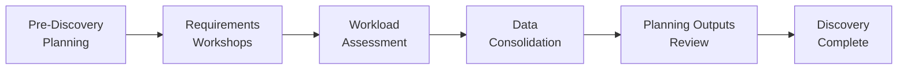

# Discovery Sessions Overview

> **DOCUMENT CATEGORY**: Runbook 
> **SCOPE**: Discovery and planning session framework 
> **PURPOSE**: Structure and guide discovery workshops 
> **MASTER REFERENCE**: [Microsoft Learn - Azure Local Planning](https://learn.microsoft.com/en-us/azure/azure-local/plan/plan-overview)

**Status**: Active

---

Discovery sessions are structured workshops conducted with stakeholders to gather requirements, assess infrastructure, and plan Azure Local deployments. This framework ensures consistent, thorough discovery across all deployments.

## Overview

The discovery process is organized into five phases that progressively build the complete picture needed for successful Azure Local deployment:

1. **Pre-Discovery Planning** - Internal preparation and scheduling
2. **Requirements Workshops** - Stakeholder interviews and requirements gathering
3. **Workload Assessment** - Technical analysis of existing workloads
4. **Data Consolidation** - Compile and validate gathered information
5. **Planning Outputs Review** - Formal review of discovery artifacts

## Sessions

| Session | Description | Duration | Participants |
|---------|-------------|----------|--------------|
| [Pre-Discovery Planning](./01-pre-discovery-planning.mdx) | Internal prep, scheduling, initial data request | 2-4 hours | deployment team |
| [Requirements Workshops](./02-customer-workshops.mdx) | Business & technical requirements gathering | 4-8 hours | All stakeholders |
| [Workload Assessment](./03-workload-assessment.mdx) | Existing infrastructure and workload analysis | 4-6 hours | Technical teams |
| [Data Consolidation](./04-data-consolidation.mdx) | Compile, validate, and organize discovery data | 2-4 hours | deployment team |
| [Planning Outputs Review](./05-deliverables-handoff.mdx) | Formal review of completed discovery package | 1-2 hours | All stakeholders |

## Workflow

## Key Deliverables

| Deliverable | Description |
|-------------|-------------|
| **Discovery Questionnaire** | Completed requirements document |
| **Site Assessment Report** | Physical and network infrastructure evaluation |
| **Workload Inventory** | Catalog of workloads to migrate/deploy |
| **Architecture Design** | Proposed cluster topology and network design |
| **Bill of Materials** | Hardware, licensing, and resource requirements |

## Prerequisites

Before beginning discovery sessions:

- [ ] Deployment approved and scheduled
- [ ] Discovery team assigned
- [ ] Initial data request sent to stakeholders
- [ ] Access to key stakeholders confirmed

## Next Steps

After completing discovery, proceed to [CI/CD Infrastructure](../../implementation/01-cicd-infra/) to establish automation infrastructure.

