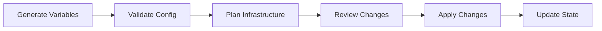

# Infrastructure Standards

> **Canonical reference:** [Infrastructure Standards (full)](https://azurelocal.cloud/standards/infrastructure/)  
> **Applies to:** All AzureLocal repositories  
> **Last Updated:** 2026-04-02

---

## Overview

Standards for Infrastructure as Code (IaC), Terraform state management, and deployment processes for AzureLocal solutions.

---

## Infrastructure Types

All infrastructure is classified by type. These are the **only** valid infrastructure types, defined in the [master registry](https://github.com/AzureLocal/azurelocal-toolkit/blob/main/config/variables/schema/master-registry.yaml):

| Type | Description | Repository |
|------|-------------|------------|
| `azure_local` | Azure Local hyper-converged clusters | `azurelocal-toolkit` |
| `avd_azure` | Azure Virtual Desktop in Azure cloud | `azurelocal-avd` |
| `avd_azure_local` | Azure Virtual Desktop on Azure Local | `azurelocal-avd` |
| `sofs_azure_local` | Scale-Out File Server on Azure Local | `azurelocal-sofs-fslogix` |
| `aks_azure_local` | Azure Kubernetes Service on Azure Local | `azurelocal-toolkit` |
| `loadtools` | Performance and load testing tools | `azurelocal-loadtools` |
| `vm_conversion` | VM generation conversion toolkit | `azurelocal-vm-conversion-toolkit` |
| `copilot` | AI-assisted operations | `azurelocal-copilot` |

:::danger[Removed Types]
The following were removed as fabricated content (2026-04-02): `wsfc_s2d`, `wsfc_san`, `scvmm`, `arc_vms`, `hyperv_host`, `arc_scvmm`, `arc_hybrid_vms`, `azure_only`. Do not reference these anywhere.
:::

---

## Infrastructure Pipeline

---

## State Management

| Principle | Rule |
|-----------|------|
| Remote state | Store Terraform state in Azure Storage Account |
| State locking | Enable locking during all operations |
| Backup | Regular state file backups before destructive operations |
| Naming | `<solution>-<env>.tfstate` (e.g., `platform-prod.tfstate`) |

---

## IaC Tool Parity

All tools must produce **identical infrastructure** when given the same configuration values:

| Tool | Primary Format | State Management |
|------|---------------|-----------------|
| Terraform | `.tf` / `.tfvars` | Remote state in Azure Storage |
| Bicep | `.bicep` / `.bicepparam` | ARM deployment history |
| ARM | `.json` | ARM deployment history |
| PowerShell | `.ps1` | Config-driven, logged |
| Ansible | `.yml` | Inventory-based |

---

## Deployment Phases

| Phase | Scope | Tools |
|-------|-------|-------|
| Phase 1: Azure Foundation | Resource groups, networking, Key Vault, storage | Terraform, Bicep, ARM |
| Phase 2: Compute & Workload | VMs, clusters, workload deployment | Terraform, PowerShell |
| Phase 3: Configuration | Guest config, monitoring, policies | PowerShell, Ansible |

---

## Related Standards

- [Infrastructure Generation & Deployment Process](https://azurelocal.cloud/standards/infrastructure/infrastructure-generation-deployment-process)
- [State Management](https://azurelocal.cloud/standards/infrastructure/state-management)
- [Solution Development Standard](solutions)
- [Variable Standards](variables) — includes master registry and infrastructure type definitions
- [Automation Interoperability](automation)