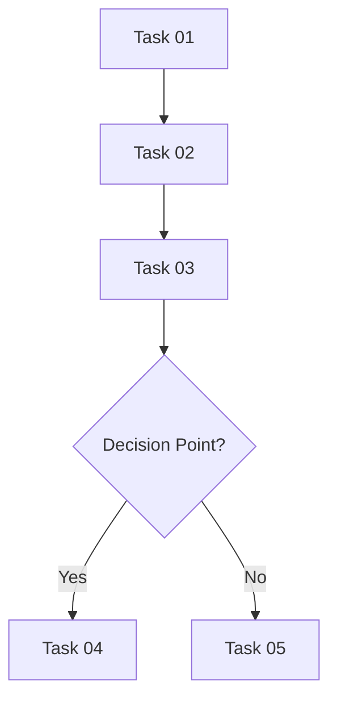

# Phase Index Page Standard Template

> Version: 1.0.0  
> Created: 2026-03-24  
> Purpose: Canonical format for all implementation phase index pages (.mdx)

This document defines the required structure for every `index.mdx` file inside a phase directory (e.g., `phase-01-hardware-provisioning/index.mdx`).

---

## 1. Frontmatter (Required)

```yaml
---
title: "Phase NN: Full Phase Title"
sidebar_label: "Phase NN: Short Label"
sidebar_position: N
description: "One-sentence description of this phase's purpose."
category: "Runbook"
scope: "Brief scope"
purpose: "What this phase achieves"
author: "Azure Local Cloudnology Team"
created: YYYY-MM-DD
updated: YYYY-MM-DD
version: "X.Y.Z"
tags:
  - azure-local
  - phase-NN
  - relevant-tag
keywords:
  - relevant keyword
status: "Active"
---
```

---

## 2. Title + Badges (Required)

```markdown
# Phase NN: Full Phase Title

[](../index.mdx)
[](https://learn.microsoft.com/en-us/azure/azure-local/)
```

Badge link for "Type" points UP to the Part-level index (`../index.mdx`).

---

## 3. Metadata Block (Required)

```markdown
> **DOCUMENT CATEGORY**: Runbook  
> **SCOPE**: [Phase scope]  
> **PURPOSE**: [What this phase accomplishes]  
> **MASTER REFERENCE**: [Link to authoritative docs for this phase]

**Status**: Active
```

---

## 4. Overview (Required)

```markdown
---

## Overview

[2-4 sentences describing the phase, what it accomplishes, and where it fits in the overall workflow.]

### What This Accomplishes

- **[Item 1]** — brief description
- **[Item 2]** — brief description
- **[Item 3]** — brief description
```

---

## 5. Prerequisites (Required)

```markdown
---

## Prerequisites

:::info [Authentication or Access Note]
[Important access requirement]
:::

| Prerequisite | Description |
|-------------|-------------|
| Previous phase complete | [Link to previous phase](../prev-phase/) |
| Access level | [Required permissions] |
| Configuration | `variables.yml` configured with required values |
```

---

## 6. Tasks Table (Required)

```markdown
---

## Tasks

| Task | Description | Duration | Link |
|------|-------------|----------|------|
| 1 | [Task 1 description] | NN min | [Task 01](./task-01-slug.mdx) |
| 2 | [Task 2 description] | NN min | [Task 02](./task-02-slug.mdx) |
```

### Rules

- Columns: Task | Description | Duration | Link
- Task number is just the integer
- Duration is an estimate (e.g., "15 min", "30-45 min")
- Links use relative paths to task files

---

## 7. Configuration Reference (Optional)

```markdown
---

## Configuration Reference

| Config Path | Description |
|-------------|-------------|
| `variables.yml → section.key` | [What this config controls] |

### IIC Example

```
[Example values from Infinite Azure Local Corp]
```
```

Include when the phase uses specific config paths. Include IIC example values.

---

## 8. Warnings (When applicable)

```markdown
:::warning Important Notes
- [Critical ordering dependency or caution]
- [Data loss risk or irreversible action note]
:::
```

---

## 9. Validation Checklist (Required)

```markdown
---

## Validation Checklist

- [ ] [All tasks in this phase completed successfully]
- [ ] [Phase-level validation item]
- [ ] [No errors in relevant logs]
```

---

## 10. Outcome (Required)

```markdown
---

## Outcome

[One paragraph describing the expected state after completing all tasks in this phase. What is now configured/available/ready.]
```

---

## 11. Workflow Diagram (Optional — recommended for phases with >3 tasks)

```markdown
---

## Workflow Diagram


```

---

## 12. Quick Start (Optional — recommended for phases with script-heavy tasks)

```markdown
---

## Quick Start

[Brief intro — "test connectivity before starting" or "verify prerequisites first"]

```powershell
# Quick validation or connectivity test
[code]
```
```

---

## 13. Next Steps (Required)

```markdown
---

## Next Steps

After completing [this phase], proceed to [Phase NN+1: Title](../next-phase/index.mdx).
```

---

## 14. References (Required when external docs exist)

```markdown
---

## References

- [Microsoft Learn — Relevant Topic](https://learn.microsoft.com/...)
- [Vendor Documentation](https://...)
```

---

## 15. Navigation (Required)

```markdown
---

## Navigation

| Previous | Up | Next |
|----------|-----|------|
| [← Phase NN-1: Title](../prev-phase/) | [Part NN: Title](../index.mdx) | [Phase NN+1: Title →](../next-phase/) |
```

---

## 16. Version Control (Required)

```markdown
---

| Version | Date | Author | Changes |
|---------|------|--------|---------|
| 1.0.0 | YYYY-MM-DD | Azure Local Cloudnology Team | Initial release |
```

---

## Complete Section Order

```
1.  Frontmatter (YAML)
2.  H1 Title + Badges
3.  Metadata Blockquote (CATEGORY/SCOPE/PURPOSE/MASTER REFERENCE)
4.  Status Line
5.  --- (horizontal rule)
6.  ## Overview (+ "What This Accomplishes" bullets)
7.  --- (horizontal rule)
8.  ## Prerequisites (admonition + table)
9.  --- (horizontal rule)
10. ## Tasks (table with Task/Description/Duration/Link)
11. --- (horizontal rule)
12. ## Configuration Reference [optional]
13. :::warning [optional]
14. --- (horizontal rule)
15. ## Validation Checklist (checkboxes)
16. --- (horizontal rule)
17. ## Outcome (paragraph)
18. --- (horizontal rule)
19. ## Workflow Diagram [optional — mermaid]
20. --- (horizontal rule)
21. ## Quick Start [optional — code block]
22. --- (horizontal rule)
23. ## Next Steps (link to next phase)
24. --- (horizontal rule)
25. ## References (bullet list of links)
26. --- (horizontal rule)
27. ## Navigation (table)
28. --- (horizontal rule)
29. Version Control (table)
```
