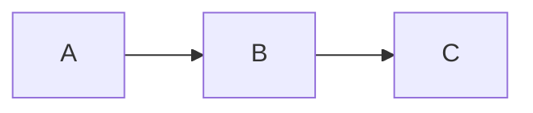

# Docusaurus Standards

[](https://docusaurus.io)
[](https://tierpoint.com)

> **DOCUMENT CATEGORY**: Standards Index  
> **SCOPE**: Docusaurus documentation platform configuration and features  
> **PURPOSE**: Guide for using Docusaurus features in TierPoint documentation  
> **MASTER REFERENCE**: [Documentation Standards](../documentation/documentation-standards.mdx)

**Status**: Active  
**Applies To**: TierPoint Product Technology Documentation Site  
**Last Updated**: 2026-01-30

---

Standards and guides for working with the Docusaurus documentation site platform.

## Overview

This section covers:

- **Site features** - Tabs, callouts, code blocks, diagrams
- **Configuration** - Site settings and customization
- **Best practices** - Performance, accessibility, SEO

## Standards in This Section

import DocCardList from '@theme/DocCardList';

<DocCardList />

## Quick Reference

| Standard | Purpose |
|----------|---------|
| [Docusaurus Features](./docusaurus-features.mdx) | Available features and components |

## Key Features

### Tabs Component

```mdx
import Tabs from '@theme/Tabs';
import TabItem from '@theme/TabItem';

<Tabs>
  <TabItem value="option1" label="Option 1">Content</TabItem>
  <TabItem value="option2" label="Option 2">Content</TabItem>
</Tabs>
```

### Callout Blocks

```mdx
:::info
Informational callout
:::

:::warning
Warning callout
:::

:::tip
Helpful tip
:::
```

### Mermaid Diagrams

````mdx

````
