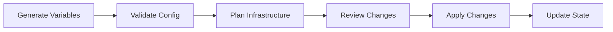

# Infrastructure Standards

> **DOCUMENT CATEGORY**: Standards Index  
> **SCOPE**: Infrastructure as Code, state management, and deployment workflows  
> **PURPOSE**: Define IaC standards and deployment processes for Azure Local environments  
> **MASTER REFERENCE**: [Documentation Standards](../documentation/documentation-standards.mdx)

**Status**: Active  
**Applies To**: All Azure Local environment repositories  
**Last Updated**: 2026-01-30

---

Standards for Infrastructure as Code (IaC), Terraform state management, and deployment processes.

## Overview

This section covers:

- **Deployment processes** - Infrastructure generation and deployment workflows
- **State management** - Terraform state file handling and governance
- **IaC patterns** - Reusable infrastructure patterns

## Standards in This Section

import DocCardList from '@theme/DocCardList';

<DocCardList />

## Quick Reference

| Standard | Purpose |
|----------|---------|
| [Infrastructure Generation & Deployment](./infrastructure-generation-deployment-process.mdx) | End-to-end deployment workflow |
| [State Management](./state-management.mdx) | Terraform state governance |

## Key Concepts

### Infrastructure Pipeline

### State File Governance

- Remote state storage (Azure Storage Account)
- State locking during operations
- State file backup and recovery
