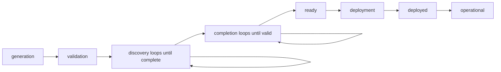

# Infrastructure Deployment State Management

[](./infrastructure-generation-deployment-process.mdx)
[](./)  
[](https://tierpoint.com)

> **DOCUMENT CATEGORY**: Standard  
> **SCOPE**: Infrastructure deployment state tracking using infra-state.json  
> **PURPOSE**: Define state management patterns for tracking deployment progress  
> **MASTER REFERENCE**: [Infrastructure Generation](./infrastructure-generation-deployment-process.mdx)

**Status**: Active  
**Applies To**: All Azure Local environment repositories  
**Last Updated**: 2026-01-30

---

## Overview

The `infra-state.json` file tracks the deployment state of an environment through all phases of infrastructure generation, discovery, validation, and deployment. It provides:

- **Progress tracking** - Know exactly which steps are complete
- **Validation status** - Track validation results and blockers
- **Discovery metadata** - Record when discovery was last run
- **Deployment readiness** - Gate deployment based on completion criteria
- **Audit trail** - Historical record of state changes

**File Location:** `infra-state.json` (root of environment repository)

---

## State Management Lifecycle

### Phase 1: Generation

**Trigger:** After `Generate-Infrastructure.ps1` creates `infrastructure.yml`

**State:**
```json
{
  "environment_name": "my-deployment",
  "infrastructure_version": "1.0.0",
  "state": {
    "phase": "generation",
    "status": "complete",
    "timestamp": "2025-12-15T10:00:00Z"
  },
  "generation": {
    "config_file": "environment-config.yml",
    "flags_used": ["azure_local", "avd_azure_local"],
    "node_count": 2,
    "storage_topology": "switchless",
    "generated_at": "2025-12-15T10:00:00Z",
    "generated_by": "user@domain.com"
  },
  "validation": {
    "yaml_syntax": "not_started",
    "base_values": "not_started",
    "last_validated": null
  },
  "discovery": {
    "azure_tenant": "not_started",
    "hardware_idrac": "not_started",
    "onprem_network": "not_started"
  },
  "deployment_readiness": {
    "is_ready": false,
    "blockers": [
      "Azure tenant discovery not run",
      "Hardware discovery not run",
      "Manual values not completed"
    ],
    "approved_by": null,
    "approved_at": null
  }
}
```

---

### Phase 2: Validation

**Trigger:** After `Validate-Infrastructure.ps1` checks YAML syntax

**State Updates:**
```json
{
  "validation": {
    "yaml_syntax": "passed",
    "base_values": "passed",
    "last_validated": "2025-12-15T10:15:00Z",
    "errors": [],
    "warnings": [
      "Hardware sections empty (expected before discovery)"
    ]
  }
}
```

---

### Phase 3: Discovery

**Trigger:** After `Inventory-AzureTenant.ps1` runs

**State Updates:**
```json
{
  "state": {
    "phase": "discovery",
    "status": "in_progress",
    "timestamp": "2025-12-15T10:30:00Z"
  },
  "discovery": {
    "azure_tenant": {
      "status": "complete",
      "timestamp": "2025-12-15T10:30:00Z",
      "resources_found": {
        "subscriptions": 1,
        "resource_groups": 12,
        "vnets": 3,
        "vms": 8,
        "key_vaults": 2
      },
      "imported": true,
      "imported_at": "2025-12-15T10:32:00Z"
    },
    "hardware_idrac": "not_started",
    "onprem_network": "not_started"
  }
}
```

**Trigger:** After `Get-DellServerInventory-FromiDRAC.ps1` runs

**State Updates:**
```json
{
  "discovery": {
    "azure_tenant": {
      "status": "complete",
      "timestamp": "2025-12-15T10:30:00Z"
    },
    "hardware_idrac": {
      "status": "complete",
      "timestamp": "2025-12-15T11:00:00Z",
      "servers_found": 2,
      "service_tags": ["XXXXXXX", "YYYYYYY"],
      "validation": {
        "meets_requirements": true,
        "issues": []
      },
      "imported": true,
      "imported_at": "2025-12-15T11:05:00Z"
    },
    "onprem_network": "not_started"
  }
}
```

---

### Phase 4: Completion

**Trigger:** After manual values completed (interactive wizard or manual editing)

**State Updates:**
```json
{
  "state": {
    "phase": "completion",
    "status": "in_progress",
    "timestamp": "2025-12-15T11:30:00Z"
  },
  "completion": {
    "manual_values": {
      "status": "complete",
      "completed_at": "2025-12-15T11:30:00Z",
      "completed_by": "user@domain.com",
      "fields_completed": [
        "domain_admin_credential_keyvault_ref",
        "local_admin_password_keyvault_ref",
        "witness_storage_account_key_keyvault_ref"
      ]
    },
    "validation_rerun": {
      "status": "passed",
      "validated_at": "2025-12-15T11:35:00Z",
      "errors": [],
      "warnings": []
    }
  }
}
```

---

### Phase 5: Deployment Readiness

**Trigger:** After all gates pass (manual approval)

**State Updates:**
```json
{
  "state": {
    "phase": "ready",
    "status": "complete",
    "timestamp": "2025-12-15T12:00:00Z"
  },
  "deployment_readiness": {
    "is_ready": true,
    "blockers": [],
    "gates_passed": [
      "infrastructure.yml validated",
      "Azure tenant discovered and imported",
      "Hardware discovered and validated",
      "Manual values completed",
      "Final validation passed"
    ],
    "approved_by": "deployment-manager@domain.com",
    "approved_at": "2025-12-15T12:00:00Z",
    "deployment_scheduled": "2025-12-16T08:00:00Z"
  }
}
```

---

### Phase 6: Deployment

**Trigger:** During deployment (Terraform/Ansible execution)

**State Updates:**
```json
{
  "state": {
    "phase": "deployment",
    "status": "in_progress",
    "timestamp": "2025-12-16T08:00:00Z"
  },
  "deployment": {
    "started_at": "2025-12-16T08:00:00Z",
    "started_by": "deploy-service-account@domain.com",
    "terraform": {
      "init": "complete",
      "plan": "complete",
      "apply": "in_progress",
      "resources_created": 24,
      "resources_updated": 3,
      "resources_destroyed": 0
    },
    "ansible": {
      "playbooks_run": ["foundation.yml"],
      "status": "pending"
    }
  }
}
```

---

### Phase 7: Post-Deployment

**Trigger:** After deployment completes successfully

**Final State:**
```json
{
  "state": {
    "phase": "deployed",
    "status": "complete",
    "timestamp": "2025-12-16T10:30:00Z"
  },
  "deployment": {
    "started_at": "2025-12-16T08:00:00Z",
    "completed_at": "2025-12-16T10:30:00Z",
    "duration_minutes": 150,
    "terraform": {
      "status": "complete",
      "resources_created": 42,
      "resources_updated": 5,
      "resources_destroyed": 0
    },
    "ansible": {
      "status": "complete",
      "playbooks_run": ["foundation.yml", "security.yml", "monitoring.yml"]
    },
    "post_deployment_validation": {
      "status": "passed",
      "validated_at": "2025-12-16T10:45:00Z",
      "checks_passed": [
        "Azure Local cluster online",
        "All nodes responding",
        "Storage Spaces Direct healthy",
        "Network connectivity validated"
      ]
    }
  }
}
```

---

## State Transitions

### Valid State Transitions



### Phase Definitions

| Phase | Description | Exit Criteria |
|-------|-------------|---------------|
| **generation** | `infrastructure.yml` created from `environment-config.yml` | File exists and is valid YAML |
| **validation** | YAML syntax and base values validated | No errors, warnings acceptable |
| **discovery** | Azure tenant and hardware discovered | All discovery sources complete and imported |
| **completion** | Manual values filled in | All required fields populated, validation passes |
| **ready** | Deployment approved and scheduled | Approval recorded, blockers cleared |
| **deployment** | Terraform/Ansible execution | Resources created, no errors |
| **deployed** | Infrastructure operational | Post-deployment validation passes |
| **operational** | Normal operations | Ongoing monitoring and maintenance |

---

## Automation Integration

### Update State from Scripts

**Example: Update after Azure Discovery**

```powershell
# Load current state
$state = Get-Content "infra-state.json" | ConvertFrom-Json

# Update discovery section
$state.discovery.azure_tenant = @{
    status = "complete"
    timestamp = (Get-Date).ToUniversalTime().ToString("yyyy-MM-ddTHH:mm:ssZ")
    resources_found = @{
        subscriptions = 1
        resource_groups = 12
        vnets = 3
        vms = 8
    }
    imported = $true
    imported_at = (Get-Date).ToUniversalTime().ToString("yyyy-MM-ddTHH:mm:ssZ")
}

# Save updated state
$state | ConvertTo-Json -Depth 10 | Set-Content "infra-state.json"
```

---

### Check Deployment Readiness

```powershell
# Check if environment is ready for deployment
$state = Get-Content "infra-state.json" | ConvertFrom-Json

if ($state.deployment_readiness.is_ready -eq $true) {
    Write-Host "[SUCCESS] Environment is ready for deployment" -ForegroundColor Green
    Write-Host "   Approved by: $($state.deployment_readiness.approved_by)"
    Write-Host "   Approved at: $($state.deployment_readiness.approved_at)"
} else {
    Write-Host "[ERROR] Environment is NOT ready for deployment" -ForegroundColor Red
    Write-Host "`nBlockers:" -ForegroundColor Yellow
    $state.deployment_readiness.blockers | ForEach-Object {
        Write-Host "  - $_"
    }
}
```

---

### GitLab CI/CD Integration

```yaml
# .gitlab-ci.yml example
validate-state:
  stage: validate
  script:
    - $state = Get-Content infra-state.json | ConvertFrom-Json
    - if ($state.deployment_readiness.is_ready -ne $true) { exit 1 }
  only:
    - main

deploy:
  stage: deploy
  script:
    - terraform apply -auto-approve
    - .\scripts\Update-InfraState.ps1 -Phase deployment -Status complete
  dependencies:
    - validate-state
  when: manual
```

---

## State File Schema

### Complete JSON Schema

```json
{
  "$schema": "http://json-schema.org/draft-07/schema#",
  "type": "object",
  "required": ["environment_name", "infrastructure_version", "state"],
  "properties": {
    "environment_name": {
      "type": "string",
      "description": "Name of the environment"
    },
    "infrastructure_version": {
      "type": "string",
      "description": "Version of infrastructure.yml schema"
    },
    "state": {
      "type": "object",
      "required": ["phase", "status", "timestamp"],
      "properties": {
        "phase": {
          "type": "string",
          "enum": ["generation", "validation", "discovery", "completion", "ready", "deployment", "deployed", "operational"]
        },
        "status": {
          "type": "string",
          "enum": ["not_started", "in_progress", "complete", "failed", "blocked"]
        },
        "timestamp": {
          "type": "string",
          "format": "date-time"
        }
      }
    },
    "generation": { "type": "object" },
    "validation": { "type": "object" },
    "discovery": { "type": "object" },
    "completion": { "type": "object" },
    "deployment_readiness": { "type": "object" },
    "deployment": { "type": "object" }
  }
}
```

---

## Troubleshooting

### Issue: State file out of sync

**Symptoms:**
- State shows "complete" but steps not actually done
- Timestamps don't match actual work

**Solution:**
```powershell
# Manually correct state file
$state = Get-Content "infra-state.json" | ConvertFrom-Json

# Reset to accurate state
$state.state.phase = "discovery"
$state.state.status = "in_progress"
$state.discovery.hardware_idrac = "not_started"

# Save corrected state
$state | ConvertTo-Json -Depth 10 | Set-Content "infra-state.json"
```

---

### Issue: Deployment blocked incorrectly

**Symptoms:**
- All steps complete but `is_ready` still `false`
- Valid blockers list outdated

**Solution:**
```powershell
# Review blockers
$state = Get-Content "infra-state.json" | ConvertFrom-Json
$state.deployment_readiness.blockers

# Manually clear if all are resolved
$state.deployment_readiness.blockers = @()
$state.deployment_readiness.is_ready = $true

# Save updated state
$state | ConvertTo-Json -Depth 10 | Set-Content "infra-state.json"
```

---

## Best Practices

### 1. Commit State Changes

```powershell
# Commit state after major milestones
git add infra-state.json
git commit -m "State: Discovery phase complete (Azure + iDRAC)"
git push
```

### 2. Backup Before Deployment

```powershell
# Create backup before deployment
Copy-Item "infra-state.json" "infra-state-backup-$(Get-Date -Format 'yyyyMMdd-HHmmss').json"
```

### 3. Automate State Updates

Create helper scripts:
```powershell
# Update-InfraState.ps1
param(
    [Parameter(Mandatory)]
    [ValidateSet("generation", "validation", "discovery", "completion", "ready", "deployment", "deployed")]
    [string]$Phase,
    
    [Parameter(Mandatory)]
    [ValidateSet("not_started", "in_progress", "complete", "failed", "blocked")]
    [string]$Status
)

$state = Get-Content "infra-state.json" | ConvertFrom-Json
$state.state.phase = $Phase
$state.state.status = $Status
$state.state.timestamp = (Get-Date).ToUniversalTime().ToString("yyyy-MM-ddTHH:mm:ssZ")
$state | ConvertTo-Json -Depth 10 | Set-Content "infra-state.json"
```

---

## Related Documentation

- [Infrastructure Generation and Deployment Process](./infrastructure-generation-deployment-process.mdx) - Complete workflow
- Tenant Discovery Process - Azure discovery state tracking *(to be created)*
- Hardware Discovery Process - iDRAC discovery state tracking *(to be created)*
- Variable Registry Process - Variable management *(to be created)*

---

**Version Control**
- Created: 2025-12-15 by Product Technology Team
- Last Edited: 2025-12-15 by Product Technology Team
- Version: 1.0.0
- Tags: state-management, deployment, tracking
- Keywords: infra-state, deployment-readiness, state-tracking
- Author: Product Technology Team

