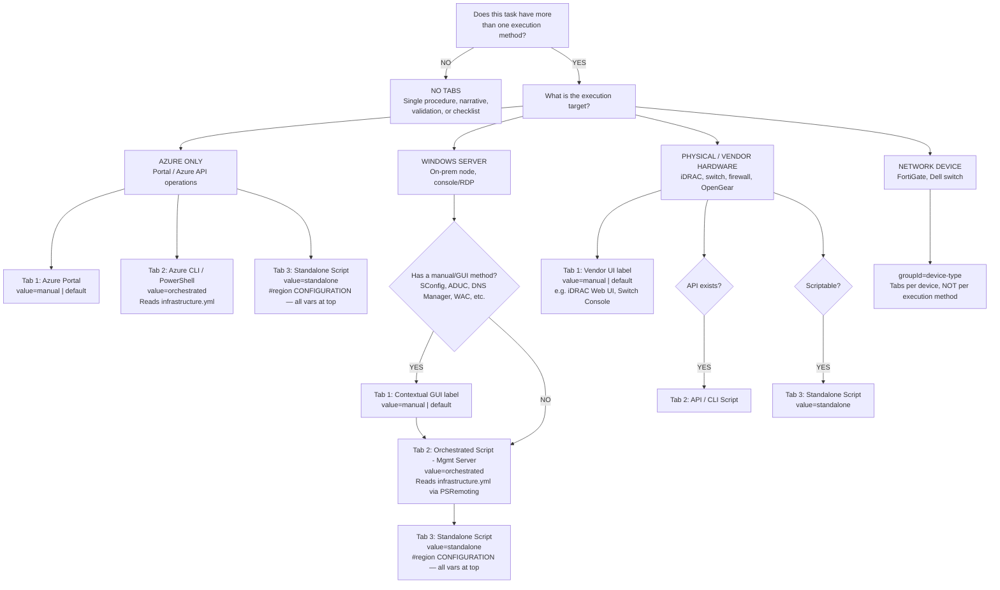

# Tab Selection Decision Logic

> **DOCUMENT CATEGORY**: Standard  
> **SCOPE**: All provisioning runbook task documents  
> **PURPOSE**: Provide a decision flowchart and reference tables for selecting the correct tab structure per task  

**Status**: Active  
**Last Updated**: 2026-03-10

---

This flowchart determines which tabs a provisioning task document requires based on its **execution target**. Every task must be classified before authoring tabs.

**Master Reference**: [Provisioning Runbook Standard](./provisioning-runbook-standard.mdx)

---

## Decision Flowchart

---

## Consistent Tab Labels

All task documents **must** use these exact label/value pairs. No variations.

### Azure-Only Tasks

| Tab | `value` | `label` | Config Source |
|-----|---------|---------|---------------|
| 1 (default) | `manual` | `Azure Portal` | N/A |
| 2 | `orchestrated` | `Azure CLI / PowerShell` | `infrastructure.yml` |
| 3 | `standalone` | `Standalone Script` | `#region CONFIGURATION` — all vars declared at top |

**Key rule**: Azure tasks operate against the control plane — there is no target node. Use Standalone Script for copy-paste execution, Azure CLI / PowerShell for config-driven execution.

### Windows Server Tasks

| Tab | `value` | `label` | Config Source |
|-----|---------|---------|---------------|
| 1 (default) | `manual` | *Contextual* (SConfig, ADUC, WAC, etc.) | N/A |
| 2 | `orchestrated` | `Orchestrated Script (Mgmt Server)` | `infrastructure.yml` via PSRemoting |
| 3 | `standalone` | `Standalone Script` | `#region CONFIGURATION` — all vars declared at top |

### Physical / Vendor Hardware Tasks

| Tab | `value` | `label` | Config Source |
|-----|---------|---------|---------------|
| 1 (default) | `manual` | *Vendor-specific* (iDRAC Web UI, Switch Console, FortiGate GUI) | N/A |
| 2 (if API) | `api` | `API / CLI Script` | Varies |
| 3 (if scriptable) | `standalone` | `Standalone Script` | `#region CONFIGURATION` |

### Network Devices

Use `groupId="device-type"` with tabs per device model, **not** per execution method.

### CI/CD Pipeline and Documentation-Only

No tabs. These are not execution-option documents.

---

## Default Tab Logic

| Condition | Default Tab |
|-----------|-------------|
| Manual tab exists | Manual tab is default |
| No manual tab | Orchestrated Script is default |

Set default using the `default` attribute on the `<TabItem>`.

---

## groupId Values

| Context | `groupId` |
|---------|-----------|
| Execution option tabs | `deployment-method` |
| Network device variant tabs | `device-type` |

---

## Common Violations

| Violation | Correction |
|-----------|------------|
| Azure-only task has no Orchestrated tab | Add `Azure CLI / PowerShell` tab (`value="orchestrated"`). |
| Azure-only task uses label `Orchestrated Script (Mgmt Server)` | Rename to `Azure CLI / PowerShell`. Keep `value=orchestrated`. |
| Windows task uses label `Azure CLI / PowerShell` | Rename to `Orchestrated Script (Mgmt Server)`. |
| Standalone Script tab has variables scattered in the script body | All variables must be declared in `#region CONFIGURATION` before any executable code. |
| Orchestrated Script reading hardcoded values instead of `infrastructure.yml` | Replace inline values with `$config.{path}` references. |
| Tabs on CI/CD or documentation-only pages | Remove tabs entirely. |
| Network device task with execution-method tabs | Use `groupId="device-type"` with per-device tabs instead. |
